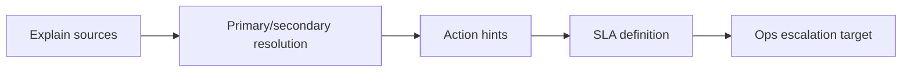

# NEFT Platform — AS-IS (текущее состояние)

> Источники: структура репозитория, docker-compose/infra конфиги, код сервисов, Alembic миграции, модели SQLAlchemy, тесты, entrypoint скрипты.

## 3.1 Executive Summary

**Что это:**

NEFT Platform в текущем виде — набор сервисов вокруг процессинга, биллинга, explainability и внешних интеграций, собранный в `docker-compose.yml` и отдельных сервисных пакетах:
* **core-api (FastAPI)** — процессинг, финансы, логистика, CRM, explainability, BI и admin/client APIs (`platform/processing-core/app`).
* **auth-host (FastAPI)** — авторизация админ/клиентских пользователей, bootstrap-аккаунты и JWT (`platform/auth-host`).
* **document-service (FastAPI)** — HTML→PDF→S3, render/presign/sign/verify (`platform/document-service`).
* **integration-hub (FastAPI + Celery)** — EDO + webhooks v1.1 (retry/replay/SLA/alerts/metrics) (`platform/integration-hub`).
* **logistics-service (FastAPI)** — ETA/deviation/explain, провайдеры mock/OSRM (`platform/logistics-service`).
* **ai-service (FastAPI)** — risk scoring endpoint (/score, /risk-score) и health/metrics (`platform/ai-services/risk-scorer`).
* **workers/beat + flower** — Celery задачи (billing/clearing/PDF/BI/ClickHouse sync) (`platform/billing-clearing`, `services/flower`).
* **frontends** — admin-web, client portal MAX и partner portal MAX (Vite SPA; `frontends/*`).
* **infra** — postgres/redis/minio/clickhouse/gateway/prometheus/grafana/otel/jaeger + loki/promtail/celery-exporter.

**Ключевые контуры управления/объяснимости (AS-IS):**
* Unified Explain v1.1: primary/secondary reason, actions, SLA, escalation (`platform/processing-core/app/services/explain`).
* Ops escalations workflow: reason taxonomy, SLA report и KPI (`platform/processing-core/app/services/ops`).
* Fleet Intelligence v1–v3 + Fleet Control v3 (`platform/processing-core/app/services/fleet_intelligence`).
* Fleet Assistant: benchmarks, projections, decision choice (`platform/processing-core/app/services/fleet_assistant`, `platform/processing-core/app/services/fleet_decision_choice`).
* Decision Memory v1 (`platform/processing-core/app/services/decision_memory`).
* What-If simulator v1 (`platform/processing-core/app/services/what_if`).
* Money Flow v3: links/snapshots/replay/CFO explain (`platform/processing-core/app/services/money_flow`).
* Navigator core (ETA/deviation snapshots + explain) (`platform/processing-core/app/services/logistics/navigator`).

**Новые/финализированные продуктовые контуры (по факту в репозитории):**
* **Portals (MAX)**
  * **Client Portal MAX**: spend/transactions, explain/insights, documents, exports, marketplace orders/catalog, analytics, client controls, i18n, UX polish (`frontends/client-portal/src/App.tsx`).
  * **Partner Portal MAX**: prices + pricing analytics, integrations (webhooks self-service), services/catalog/offers, orders/refunds, payouts/docs links, i18n, UX polish (`frontends/partner-portal/src/App.tsx`).
* **Marketplace**: UI flows в клиентском/партнёрском порталах + контрактные события (schemas) (`docs/contracts/events/marketplace/*.json`).
* **Webhooks v1.1**: replay scheduling, pause/resume, SLA/alerts/metrics, partner UI controls (`platform/integration-hub`, `frontends/partner-portal/src/pages/IntegrationsPage.tsx`).
* **BI / Analytics / Exports v1.1**: BI mart модели/агрегация, BI API read-only, CSV/JSONL exporters + manifest, ClickHouse sync + metrics (`platform/processing-core/app/services/bi`, `app/api/v1/endpoints/bi.py`).
* **Support Inbox v1**: backend model/migration/api + client/partner UI list/detail/create (`platform/processing-core/app/api/v1/endpoints/support_requests.py`, portal pages).
* **Client Controls v1**: limits/users/services/features tabs, role gating, confirmation modals, API wiring/types (`frontends/client-portal/src/pages/ClientControlsPage.tsx`).
* **PWA v1 (client portal companion)**: manifest/service worker, PWA routing/layout, push subscribe/unsubscribe wiring, offline last-updated indicators (`frontends/client-portal/public`, `frontends/client-portal/src/pwa`).
* **OSRM / Diadok prod-mode**: OSRM provider implementation + tests (`platform/logistics-service`), Diadok prod-mode flags in integration-hub settings (`platform/integration-hub/neft_integration_hub/settings.py`).

**Для чего пригодна (фактически):**

* CRUD/операции процессинга (operations, merchants, terminals, cards, clients) и риск-правила в core-api.
* Биллинг/инвойсинг: генерация периодов, сводок, инвойсов, PDF, финоперации по инвойсам (payments/credit notes/refunds), аудит переходов, job runs.
* Клиринг: дневные batch + привязка операций, статусы, запуск через API.
* Payouts/settlements: создание batch, экспорт, mark-sent/settled, S3 storage экспорта.
* Документы: issue/ack/finalize + подписание/проверка и render в document-service.
* Логистика: ETA/deviation/explain в logistics-service + navigator snapshots в core-api.
* Webhooks/EDO: dispatch, delivery, replay, SLA и алерты в integration-hub.
* BI/Analytics: read-only API, выгрузки CSV/JSONL + manifest, ClickHouse sync.
* Клиентский/партнёрский/админ порталы и support inbox UI.
* Метрики в Prometheus-формате (core-api, auth-host, ai-service, integration-hub, logistics-service, document-service).

**Статус платформы (по факту в репозитории):**

* core-api стартует, проверяет Alembic heads и применяет миграции (`platform/processing-core/entrypoint.sh`).
* Сервисы в compose поднимаются без блокирующих ошибок, health/metrics endpoints объявлены.
* CI фиксирует enum policy, contract tests, alembic smoke и packaging/installation (см. `.github/workflows`).
* Критичные домены подтверждены: core-api ✅, documents ✅, logistics-service ✅, integration-hub ✅, BI exports ✅, support inbox ✅.

**Known limitations (current):**

* auth-host не имеет Alembic миграций (bootstrap SQL при старте).
* integration-hub по умолчанию использует SQLite (требует внешней БД для прод-режима).
* Client Controls и PWA push используют API wiring, но backend endpoints `/notifications/*` и `/client/*` (users/services/features) отсутствуют в core-api.
* Diadok prod credentials не заданы в репозитории (DIADOK_MODE по умолчанию `mock`).
* OSRM требует отдельный runtime сервис (в compose не поднимается).
## 3.1.0 Scope snapshot (обязательные рамки)

**Что есть:**
* Unified Explain v1.1 (primary/secondary reasons, actions, SLA, escalations) — `platform/processing-core/app/services/explain`.
* Ops escalations workflow + KPI/SLA reports — `platform/processing-core/app/services/ops`.
* Fleet Intelligence v1–v3 + Fleet Control v3 — `platform/processing-core/app/services/fleet_intelligence`.
* Fleet Assistant (benchmarks/projections/decision choice) — `platform/processing-core/app/services/fleet_assistant`, `platform/processing-core/app/services/fleet_decision_choice`.
* Decision Memory v1 — `platform/processing-core/app/services/decision_memory`.
* What-If Simulator v1 — `platform/processing-core/app/services/what_if`.
* Money Flow v3 (links/snapshots/replay/CFO explain) — `platform/processing-core/app/services/money_flow`.
* Navigator core (snapshots/explains) — `platform/processing-core/app/services/logistics/navigator`.
* Integration Hub (EDO + webhooks v1.1) — `platform/integration-hub`.
* Document Service (HTML→PDF→S3 + sign/verify) — `platform/document-service`.
* Logistics Service (ETA/deviation/explain, mock/OSRM) — `platform/logistics-service`.
* BI v1.1 (read-only API + exports CSV/JSONL + manifest + ClickHouse sync) — `platform/processing-core/app/services/bi`.
* Support Inbox v1 — `platform/processing-core/app/api/v1/endpoints/support_requests.py`.
* Portals MAX (client + partner) — `frontends/client-portal`, `frontends/partner-portal`.
* PWA mode for client portal — `frontends/client-portal/public/manifest.webmanifest`.

**Что не делаем сейчас:**
* Полноценные внешние e-sign/EDI/ERP провайдеры (кроме mock/flags).
* ML/LLM компоненты в Fleet Assistant/What-If (детерминированные правила).
* Автоматическое применение Fleet Control actions без ручного approve/apply.
* Отдельный runtime для OSRM (нужен внешний сервис).

**Что флагом:**
* `LOGISTICS_NAVIGATOR_ENABLED` / `LOGISTICS_NAVIGATOR_PROVIDER` (`docs/logistics/navigator_core.md`).
* `LOGISTICS_SERVICE_ENABLED` / `LOGISTICS_SERVICE_URL` (`shared/python/neft_shared/settings.py`).
* `DOCUMENT_SERVICE_ENABLED` / `DOCUMENT_SERVICE_URL` (document-service integration).
* `BI_CLICKHOUSE_ENABLED` / `CLICKHOUSE_URL` / `CLICKHOUSE_DB`.
* `INTEGRATION_HUB_WEBHOOK_SECRET_KEY`, `WEBHOOK_MAX_ATTEMPTS`, `WEBHOOK_SLA_SECONDS`.
* `DIADOK_MODE`, `DIADOK_API_TOKEN` (integration-hub EDO).
* `VITE_PWA_MODE`, `VITE_PUSH_PUBLIC_KEY` (client portal PWA).

**Что заморожено:**
* CRM control plane API требует версию (`X-CRM-Version`) — изменения только через versioning.
* Risk v4 reference (см. `docs/risk_engine_v4.md`).
* Unified Explain v1.1, Money Flow v3, Fleet Control v3 (фиксированные контуры).

---

## 3.1.1 Current runtime status (docker compose)

**Текущее состояние стенда (по docker-compose.yml):**

* **core-api** — healthy (`8001 → 8000` в контейнере).
* **gateway** — up (`80`).
* **admin-web** — up/healthy (`4173`).
* **client-web** — up/healthy (`4174`).
* **auth-host** — up (`8002 → 8000`).
* **ai-service** — up (`8003 → 8000`).
* **workers / beat / flower** — up (Flower `5555`).
* **postgres** — up (`5432`), **redis** — up (`6379`).
* **clickhouse** — up (`8123`, `9002 → 9000`).
* **grafana** — up (`3000`), **prometheus** — up (`9090`), **jaeger** — up (`16686`), **otel-collector** — up (`4317`).
* **minio** — up (`9000/9001`), **minio-init** — `exited=0`, **minio-health** — up.
* **crm-service** — stub health/metrics (`/health`, `/metrics`).
* **logistics-service** — internal (`/health`, `/metrics`, `/v1/eta`, `/v1/deviation`, `/v1/explain`).
* **document-service** — internal (`/health`, `/metrics`, `/v1/render`, `/v1/sign`, `/v1/verify`, `/v1/presign`).
* **integration-hub** — сервис в compose (`8010 → 8000`, `/health`, `/metrics`).
* **partner-portal** — отдельный фронтенд (`4175`).
* **loki / promtail** — сбор логов (`3100`, `9080`).
* **celery-exporter** — метрики Celery (`9808`).

**Факты по проверкам (на поднятом стенде):**

* `GET http://localhost:8001/api/core/health` → `{"status":"ok"}`.
* `GET http://localhost:8001/metrics` → Prometheus-метрики, `core_api_up 1`.
* `GET http://localhost/api/core/health` через gateway → `{"status":"ok"}`.

---

## 3.1.2 Migrations stabilization: what was fixed

**Цель:** убрать ошибки парсинга/создания типов/конфликтов head, сделать повторный прогон миграций безопасным.

### Syntax/parse errors in migrations
* **Проблема:** `SyntaxError` из-за экранированных кавычек в f-string (`f\"{SCHEMA}...\"`).
* **Причина:** некорректный синтаксис в миграции CRM.
* **Решение:** нормализованы строки до обычных f-strings.
* **Текущее состояние:** миграция `20291405_0066_crm_subscriptions_v1.py` корректно парсится.

### Multiple heads
* **Проблема:** в репозитории было **2 head** (`20290510_0046...` и `20291410_0067...`).
* **Причина:** параллельные ветки миграций (CRM/логистика).
* **Решение:** добавлен merge revision `20291415_0068_merge_heads_0046_0067`.
* **Текущее состояние:** единый head — `20291415_0068_merge_heads_0046_0067`.

### ENUM idempotency (DuplicateObject)
* **Проблема:** `DuplicateObject` при повторном прогоне миграций (fuel/logistics/crm).
* **Причина:** `CREATE TYPE` без проверки существования и использование `sa.Enum(name=...)` без `create_type=False`.
* **Решение:** единый паттерн:
  * функции `ensure_pg_enum(...)` и `ensure_pg_enum_value(...)` (см. `platform/processing-core/app/alembic/helpers.py`, `app/alembic/utils.py`);
  * в колонках только `postgresql.ENUM(..., create_type=False, schema=SCHEMA)`;
  * запрет на “голые” `sa.Enum(name=...)` без `create_type=False`.
* **Текущее состояние:** миграции fuel/logistics/crm повторно применимы без ошибок `DuplicateObject`.

### FK datatype mismatch (varchar vs uuid)
* **Проблема:** `DatatypeMismatch` при создании FK (например, PK = `UUID`, FK = `VARCHAR`).
* **Причина:** несогласованные типы ключей в CRM/fuel доменах.
* **Решение:** приведены поля к `UUID`, в т.ч. `billing_period_id` и связанные FK в миграциях fuel/CRM.
* **Текущее состояние:** правило зафиксировано — **тип FK = тип PK целевой таблицы**.

### Entrypoint migration validation
* **Проблема:** риск старта `uvicorn` на неконсистентной БД.
* **Решение:** entrypoint проверяет heads/таблицы/regclass и только потом стартует API.
* **Текущее состояние:** head — `20291415_0068_merge_heads_0046_0067`, checks выполняются до `uvicorn`.

---

## 3.1.3 App boot fixes

**Проблемы старта core-api (uvicorn):**

* **SyntaxError:** `non-default argument follows default argument` в CRM admin router.
  * **Причина:** параметр без дефолта располагался после параметра с дефолтом.
  * **Решение:** исправлен порядок аргументов.
* **Импортные конфликты моделей (FuelRouteLink и связанные модели fuel/logistics):**
  * **Причина:** несогласованность экспортов/импортов между доменами.
  * **Решение:** поправлены импорты и определения моделей.

**Текущее состояние:** лог старта `core-api` доходит до `startup complete`, healthchecks проходят.

---

## 3.1.4 Frontends status (MAX)

### client-portal (MAX)
* Разделы: spend/transactions, explain/insights, documents, exports, marketplace, analytics, support, client controls.
* PWA режим: manifest + service worker + ограниченный маршрут (orders/documents) и push wiring.
* Статус: сборка проходит, контейнер healthy (compose `client-web`).

### partner-portal (MAX)
* Разделы: prices/pricing analytics, services/catalog/offers, orders/refunds, payouts, documents, webhooks self-service, support.
* Статус: SPA в репозитории (Vite), контейнер `partner-web` поднимается в compose, порт `4175`.

### admin-web
* Админ UI (billing/finance/ops/logistics) — docker build проходит, контейнер healthy.

---

## 3.1.5 Observability

**Порты и endpoints (локально):**

* **Prometheus:** `9090`
* **Grafana:** `3000`
* **Jaeger UI:** `16686`
* **OTel collector:** `4317`
* **core-api metrics:** `http://localhost:8001/metrics` (также через gateway `/metrics`)
* **auth-host metrics:** `http://localhost:8002/metrics`
* **ai-service metrics:** `http://localhost:8003/metrics`
* **document-service metrics:** `http://document-service:8000/metrics` (internal)
* **logistics-service metrics:** `http://logistics-service:8000/metrics` (internal)
* **integration-hub metrics:** `/metrics` (отдельный сервис)
* **Loki:** `3100`
* **Promtail:** `9080`
* **Celery exporter:** `9808` (`/metrics`)

---

## 3.1.6 Contract discipline & CI gates

* **Contract testing:** `pytest -m contracts` (API + events).
* **Event registry:** `docs/contracts/events/**` (включая `marketplace/` поддиректории).
* **Required CI checks:** smoke (alembic idempotency + smoke tests), enum policy, contracts, packaging/installation (`.github/workflows`).

---

## 3.1.7 Warnings & tech debt

* **auth-host без миграций:** таблицы создаются при старте (bootstrap SQL).
* **integration-hub DB:** по умолчанию SQLite (`INTEGRATION_HUB_DATABASE_URL` не задан).
* **PWA push:** фронтенд вызывает `/notifications/subscribe|unsubscribe`, backend endpoints отсутствуют.
* **Client Controls:** UI + API wiring есть, но backend endpoints `/client/users|services|features` отсутствуют.
* **Diadok prod-mode:** параметры заданы флагами, но prod credentials не включены в репозиторий.
* **OSRM runtime:** провайдер реализован, но отдельный OSRM сервис не поднимается в compose.

---

## 3.1.8 Local verification checklist

Команды (копипаст, 10–15 шагов):

```bash
docker compose up -d --build
docker compose ps

curl http://localhost:8001/api/core/health
curl http://localhost:8001/metrics
curl http://localhost/api/core/health
curl http://localhost/api/auth/health
curl http://localhost/api/ai/api/v1/health
curl http://localhost:8002/metrics
curl http://localhost:8003/metrics

docker compose logs -n 200 core-api
docker compose exec -T core-api sh -lc "alembic -c app/alembic.ini heads"
docker compose exec -T core-api sh -lc "alembic -c app/alembic.ini current"
docker compose exec -T postgres psql -U neft -d neft -c "select * from public.alembic_version;"
docker compose exec -T postgres psql -U neft -d neft -c "select 1;"

docker compose exec -T redis redis-cli ping
docker compose exec -T minio mc ls local
docker compose exec -T logistics-service wget -qO- http://localhost:8000/health
docker compose exec -T document-service wget -qO- http://localhost:8000/health
```

---

## 3.1.9 Взаимодействие сервисов (high-level)

* **Frontends → Gateway → Core/Auth/AI:** admin-web, client-web и partner-web обращаются к API через `gateway`, который проксирует `/api/core/*`, `/api/auth/*`, `/api/ai/*` на соответствующие сервисы.
* **Core API ↔ Postgres/Redis/MinIO/ClickHouse:** core-api хранит доменные данные в Postgres, использует Redis (кэш/очереди), S3 (MinIO) для инвойсов/экспортов/документов и ClickHouse для BI (по флагу).
* **Core API → Document/Logistics:** document-service включается флагом `DOCUMENT_SERVICE_ENABLED`, logistics-service — `LOGISTICS_SERVICE_ENABLED`; взаимодействие по HTTP.
* **Workers/Beat → Core API/Redis/MinIO/ClickHouse:** фоновые задачи биллинга/клиринга/экспортов и генерации PDF используют Redis как брокер и обращаются к core-api и S3.
* **Integration Hub ↔ Postgres/Redis/MinIO:** интеграции и webhooks используют свою БД, Redis и S3; webhook delivery/EDO события живут в отдельном сервисе.
* **Observability:** Prometheus собирает метрики с gateway и сервисов, Grafana и Jaeger читают из Prometheus/OTel; Loki/Promtail собирают логи контейнеров.

---

## 3.2 Карта сервисов

| Сервис | Назначение (факт) | Порты / health / metrics | Key env vars | Зависимости | Статус |
| --- | --- | --- | --- | --- | --- |
| core-api | Основная бизнес-логика: processing, billing, clearing, payouts, explain, BI API | `8001→8000`, `/api/core/health`, `/metrics` | `DATABASE_URL`, `DOCUMENT_SERVICE_ENABLED`, `DOCUMENT_SERVICE_URL`, `LOGISTICS_SERVICE_ENABLED`, `LOGISTICS_SERVICE_URL`, `BI_CLICKHOUSE_ENABLED`, `CLICKHOUSE_URL` | postgres, redis, minio, clickhouse (опц.), document-service (опц.), logistics-service (опц.) | ✅ |
| auth-host | Авторизация пользователей, JWT, bootstrap admin | `8002→8000`, `/api/auth/health`, `/metrics` | `DATABASE_URL`, `NEFT_AUTH_ISSUER`, `NEFT_AUTH_AUDIENCE`, `NEFT_BOOTSTRAP_*`, `NEFT_BOOTSTRAP_ENABLED`, `DEMO_SEED_*` | postgres, redis | 🟡 (без миграций) |
| document-service | Render HTML→PDF + S3, sign/verify | internal `8000`, `/health`, `/metrics` | `S3_ENDPOINT`, `S3_KEY`, `S3_SECRET`, `S3_BUCKET_DOCS` | minio | ✅ |
| integration-hub | EDO + webhooks v1.1 (replay/SLA/alerts) | `8010→8000`, `/health`, `/metrics` | `INTEGRATION_HUB_DATABASE_URL`, `WEBHOOK_*`, `DIADOK_*` | redis, DB, minio | ✅ |
| logistics-service | ETA/deviation/explain + providers mock/OSRM | internal `8000`, `/health`, `/metrics` | `LOGISTICS_PROVIDER`, `OSRM_BASE_URL`, `OSRM_TIMEOUT_SECONDS` | внешн. OSRM (опц.) | ✅ |
| ai-service | Risk scoring API | `8003→8000`, `/api/ai/health`, `/metrics` | `API_PREFIX_AI`, `SERVICE_NAME` | redis | 🟡 (stub scoring) |
| workers / beat | Celery задачи: billing/clearing/pdf/BI/ClickHouse sync | — | `CELERY_*`, `NEFT_*`, `BI_CLICKHOUSE_ENABLED` | redis, core-api, minio | ✅ |
| flower | UI для Celery | `5555` | `FLOWER_BASIC_AUTH` | redis, workers | ✅ |
| admin-web | Admin UI | `4173` | `VITE_API_BASE` | gateway | ✅ |
| client-web | Client portal MAX + PWA mode | `4174` | `VITE_API_BASE`, `VITE_PWA_MODE` | gateway | ✅ |
| partner-portal | Partner portal MAX | `4175` | `VITE_API_BASE_URL` | gateway | ✅ |
| gateway | Nginx API + SPA gateway | `80`, `/health`, `/metrics` | — | core-api, auth-host, ai-service, SPA | ✅ |
| postgres | Основная БД | `5432` | `POSTGRES_*` | volume | ✅ |
| redis | Broker/результаты Celery | `6379` | — | — | ✅ |
| minio | S3 storage | `9000/9001` | `MINIO_ROOT_USER`, `MINIO_ROOT_PASSWORD` | volume | ✅ |
| clickhouse | BI mart storage | `8123`, `9002→9000` | `CLICKHOUSE_DB` | volume | ✅ |
| celery-exporter | Prometheus exporter для Celery | `9808`, `/metrics` | `CELERY_BROKER_URL` | redis | ✅ |
| prometheus | Metrics scrape | `9090` | — | gateway | ✅ |
| grafana | Metrics dashboards | `3000` | `GF_PATHS_PROVISIONING` | prometheus | ✅ |
| jaeger | Tracing UI | `16686`, `14250` | `COLLECTOR_OTLP_ENABLED` | otel-collector | ✅ |
| otel-collector | OTLP receiver | `4317` | — | — | ✅ |
| loki | Log storage | `3100` | — | volume | ✅ |
| promtail | Log shipper | `9080` | — | docker socket, loki | ✅ |
| crm-service | Stub service (health/metrics only) | internal `8000`, `/health`, `/metrics` | — | — | 🟡 |

---

## 3.3 Домены и модули (реализованные)

### Auth / users / roles

* **Назначение:** учётные записи админ/клиентских пользователей с ролями.
* **Код:** `platform/auth-host/app`.
* **Сущности:** users, user_roles (таблицы создаются в `app/db.py`).
* **API:** `/api/v1/auth/*`, `/api/v1/admin/users/*` (см. Appendix D)
* **Фоновые процессы:** отсутствуют.
* **БД:** `users`, `user_roles` (Postgres, прямой SQL).
* **Статус:** 🟡 — базовая auth + bootstrap admin, нет полноценной миграционной стратегии.

### Accounts / balances / ledger

* **Назначение:** бухгалтерский учет и балансы.
* **Сущности:** `accounts`, `account_balances`, `ledger_entries`, `posting_batches`.
* **Код:** `platform/processing-core/app/models/account.py`, `ledger_entry.py`, `posting_batch.py`.
* **API:** `/v1/admin/accounts/*`, `/v1/admin/accounts/{client_id}/balances`.
* **Фоновые процессы:** posting engine (в core-api services). Celery задачи отдельно не описаны.
* **БД:** таблицы перечислены в секции 3.6.
* **Статус:** 🟡 — есть модели, posting engine и API, но домен зависит от операций и биллинга.

### Cards / card groups

* **Назначение:** карточки и группировка карточек/клиентов.
* **Сущности:** `cards`, `card_groups`, `card_group_members`, `client_groups`, `client_group_members`.
* **Код:** `app/models/card.py`, `app/models/groups.py`, `app/routers/admin/limits.py`.
* **API:** `/v1/admin/limits/*`, `/v1/admin/card-groups/*` и legacy `/v1/admin/groups_legacy.py`.
* **Фоновые процессы:** отсутствуют.
* **Статус:** 🟡 — CRUD и группирование, но есть дублирующиеся legacy endpoints.

### Billing (summary/periods)

* **Назначение:** агрегации по операциям и периоды биллинга.
* **Сущности:** `billing_summary`, `billing_periods`, `billing_job_runs`, `billing_task_links`.
* **Код:** `app/services/billing_*`, `app/services/billing/daily.py`, `app/models/billing_*`.
* **API:** `/v1/admin/billing/*`, `/api/v1/billing/*`.
* **Фоновые процессы:** Celery `billing.build_daily_summaries`, `clearing.finalize_billing`.
* **Статус:** ✅ — lifecycle finalize/lock защищён policy engine, billing hardening и инварианты реализованы.

### Invoices

* **Назначение:** инвойсы и их lifecycle.
* **Сущности:** `invoices`, `invoice_lines`, `invoice_transition_logs`.
* **Код:** `app/models/invoice.py`, `app/services/invoice_state_machine.py`, `app/services/billing_invoice_service.py`.
* **API:** `/api/v1/invoices/*`, `/v1/admin/billing/invoices/*`, `/v1/client/invoices/*`.
* **Фоновые процессы:** `billing.generate_invoice_pdf`, `billing.generate_monthly_invoices`.
* **Статус:** ✅ ядро lifecycle + PDF + финоперации есть, charges immutable после finalize/lock.

### Finance / payments / credit notes / refunds

* **Назначение:** учёт платежей, credit notes и возвратов по инвойсам.
* **Сущности:** `invoice_payments`, `credit_notes`, `refund_requests`.
* **Код:** `app/services/finance.py`, `app/models/finance.py`.
* **API:** `/api/v1/invoices/{id}/payments`, `/api/v1/invoices/{id}/refunds`, `/v1/admin/finance/*`.
* **Фоновые процессы:** нет (всё синхронно в core-api).
* **Статус:** ✅ — есть идемпотентность, state machine, settlement_allocation и аудит.

### Accounting export (accounting_export_batch)

* **Назначение:** выгрузки charges/settlement по периодам.
* **Сущности:** `accounting_export_batches` (accounting_export_batch).
* **Код:** `app/services/accounting_export_service.py`, `app/services/accounting_export/serializer.py`.
* **API:** `/v1/admin/accounting/exports/*`.
* **Фоновые процессы:** нет (синхронно, в core-api).
* **Статус:** ✅ — deterministic serializer, sha256, S3 upload/download, confirm + RBAC gating.

### Document Service (HTML→PDF→S3 + sign/verify)

* **Назначение:** генерация документов и подпись/верификация.
* **API:** `/v1/render`, `/v1/presign`, `/v1/sign`, `/v1/verify` (`platform/document-service/app/main.py`).
* **Хранение:** S3 bucket `NEFT_S3_BUCKET_DOCUMENTS`.
* **Статус:** ✅ — render и подпись через встроенные провайдеры.

### Integration Hub (EDO + webhooks v1.1)

* **Назначение:** EDO отправка/статусы + webhooks delivery/replay/SLA/alerts.
* **API:** `/v1/edo/dispatch`, `/v1/edo/documents/{id}`, `/v1/webhooks/*` (`platform/integration-hub/neft_integration_hub/main.py`).
* **Очереди:** Celery задачи `edo.send`, webhooks deliveries.
* **Статус:** ✅ — retry/replay, pause/resume, SLA и alerting по метрикам.

### Logistics Service (ETA/deviation/explain)

* **Назначение:** вычисление ETA и deviation с explain.
* **API:** `/v1/eta`, `/v1/deviation`, `/v1/explain` (`platform/logistics-service/neft_logistics_service/main.py`).
* **Провайдеры:** mock/OSRM (`LOGISTICS_PROVIDER`, `OSRM_BASE_URL`).
* **Статус:** ✅ — OSRM provider с fallback на mock.

### BI / Analytics / Exports v1.1

* **Назначение:** BI модели, read-only API и выгрузки CSV/JSONL + manifest.
* **API:** `/api/v1/bi/*` (`platform/processing-core/app/api/v1/endpoints/bi.py`).
* **Экспорты:** datasets orders/order_events/payouts/declines/daily_metrics (`app/services/bi/exports`).
* **ClickHouse sync:** `app/services/bi/clickhouse.py`, task `bi.clickhouse_sync`.
* **Статус:** ✅ — экспорты генерируются в S3, ClickHouse sync включается флагом.

### Support Inbox v1

* **Назначение:** support requests для client/partner с timeline.
* **API:** `/api/v1/support/requests` (create/list/detail/status).
* **Миграции:** `20291660_0088_support_requests.py`.
* **Статус:** ✅ — backend + UI в client/partner portals.

### Marketplace (UI + event contracts)

* **Назначение:** каталог/офферы/заказы/рефанды в порталах, события маркетплейса.
* **Контракты событий:** `docs/contracts/events/marketplace/*.json`.
* **Статус:** ✅ — UI и контракты событий; backend домена в core-api не выделен.

### Portals MAX (Client/Partner)

* **Client Portal MAX:** spend/explain/docs/exports/marketplace/orders/analytics/controls/self-service + i18n.
* **Partner Portal MAX:** prices/pricing analytics/integrations/webhooks self-service/services/catalog/offers/orders/refunds/payouts/docs + i18n.
* **Статус:** ✅ — Vite SPA, запускаются отдельно от compose.

### Client Controls v1

* **Назначение:** управление лимитами/пользователями/услугами/возможностями с role gating.
* **UI:** `frontends/client-portal/src/pages/ClientControlsPage.tsx`.
* **API wiring:** `/client/limits`, `/client/users`, `/client/services`, `/client/features`.
* **Статус:** 🟡 — UI/типизация есть, backend endpoints не реализованы.

### PWA v1 (client portal companion)

* **Назначение:** PWA режим, offline индикаторы, push wiring.
* **Файлы:** `frontends/client-portal/public/manifest.webmanifest`, `public/sw.js`, `src/pwa/*`.
* **Статус:** 🟡 — UI и service worker есть, push endpoints отсутствуют.

### Clearing / settlement / payouts

* **Назначение:** клиринг и выплаты партнёрам.
* **Сущности:** `clearing`, `clearing_batch`, `clearing_batch_operation`, `settlements`, `payout_batches`, `payout_orders`, `payout_items`, `payout_export_files`, `payout_events`.
* **Код:** `app/services/clearing_*`, `app/services/payouts_service.py`, `app/models/clearing.py`, `app/models/payout_*`.
* **API:** `/v1/admin/clearing/*`, `/api/v1/payouts/*`, `/v1/admin/settlements/*`.
* **Фоновые процессы:** Celery `clearing.build_daily_batch`.
* **Статус:** 🟡 — основные сущности и API реализованы, но часть инфраструктуры и интеграций отсутствует.

### Merchants / clients / documents

* **Назначение:** клиенты, мерчанты, терминалы, документы и клиентские действия.
* **Сущности:** `clients`, `merchants`, `terminals`, `documents`, `document_files`, closing_package, `client_actions`, `reconciliation_requests`.
* **Код:** `app/models/client.py`, `app/models/merchant.py`, `app/models/terminal.py`, `app/models/documents.py`, `app/models/client_actions.py`.
* **API:** `/api/v1/clients`, `/api/v1/merchants`, `/v1/admin/documents`, `/api/v1/client/*`.
* **Фоновые процессы:** отсутствуют.
* **Статус:** ✅ — legal finalization lifecycle, hash/document chain, immutable guards, policy checks для acknowledgement/finalize.

### Risk rules / limits

* **Назначение:** антифрод + лимиты по клиентам/картам.
* **Сущности:** `risk_rules`, `risk_rule_versions`, `risk_rule_audits`, `limit_rules`, `limit_configs`.
* **Код:** `app/services/risk_rules.py`, `app/services/limits.py`, `app/models/risk_rule.py`, `app/models/limits.py`.
* **API:** `/v1/admin/risk/*`, `/v1/admin/limits/*`, `/api/v1/limits`.
* **Фоновые процессы:** Celery `limits.check_and_reserve`, `limits.recalc_*`.
* **Статус:** 🟡 — правила и лимиты реализованы, ML/AI остаётся heuristic/stub.

### Decision engine / risk scoring

* **Назначение:** детерминированные решения по критичным операциям (fail-closed).
* **Сущности:** `decision_results` (audit), `risk_scores` (таблица под риск события; write-path пока не найден).
* **Код:** `app/services/decision/*`, `app/services/transactions_service.py`.
* **API:** decision engine встроен в core-api (вызовы при authorize, payout export, accounting export, billing finalize).
* **Версия:** `DECISION_ENGINE_VERSION = v1`.
* **AI сервис:** `/api/v1/score` (legacy), `/api/v1/risk-score` v2 + `/admin/ai/train-model`, `/admin/ai/update-model`.
* **Статус:** ✅ — decision engine пишет audit/decision_results; v2 endpoints есть (heuristic/stub).

---

### Fuel domain (authorize/settle/reverse, limits v2, antifraud v3)

* **Назначение:** топливные транзакции B2B с лимитами, risk и ledger posting.
* **Код:** `platform/processing-core/app/services/fuel/*`, `platform/processing-core/app/routers/admin/fuel.py`,
  `platform/processing-core/app/api/v1/endpoints/fuel_transactions.py`.
* **Миграции:** `20291301_0059_fuel_domain_v1.py`, `20291320_0060_fuel_domain_v2.py`,
  `20291501_0069_fuel_antifraud_v3.py`, limits v2 — `20251120_0003_limits_rules_v2.py`.
* **Docs:** `docs/fuel/fuel_domain_v1.md`, `docs/fuel/limits_model.md`.
* **Tests:** `test_fuel_authorize_flow.py`, `test_fuel_settle_ledger.py`,
  `test_fuel_fraud_signals.py`, `test_limits_v2.py`.

### Logistics v1/v2 + Navigator core (snapshots/explains)

* **Назначение:** маршруты, ETA/deviation snapshots, navigator adapters.
* **Код:** `platform/processing-core/app/services/logistics/*`,
  `platform/processing-core/app/services/logistics/navigator/*`,
  `platform/processing-core/app/routers/admin/logistics.py`,
  `platform/processing-core/app/api/v1/endpoints/logistics.py`.
* **Миграции:** `20291325_0062_logistics_core_v1.py`, `20291330_0063_logistics_core_v2.py`,
  `20291520_0074_logistics_navigator_core.py`.
* **Docs:** `docs/logistics/navigator_core.md`.
* **Tests:** `test_logistics_routes.py`, `test_logistics_eta.py`, `test_logistics_navigator_core.py`,
  `test_logistics_deviation_v2.py`, `test_logistics_fuel_linker_v2.py`.

### CRM control plane + subscriptions v2 (proration/tariffs v2)

* **Назначение:** CRM клиенты/контракты/тарифы, подписки v2 и сегменты.
* **Код:** `platform/processing-core/app/services/crm/*`, `platform/processing-core/app/routers/admin/crm.py`.
* **Интеграции:** subscription billing пишет money flow links (`app/services/crm/subscription_billing.py`).
* **Миграции:** `20291401_0065_crm_core_v1.py`, `20291405_0066_crm_subscriptions_v1.py`,
  `20291420_0071_subscriptions_v2_segments_and_rules.py`, `20291430_0073_crm_feature_flag_subscription_meter_fuel.py`.
* **Docs:** `docs/crm/subscriptions_v2.md`.
* **Tests:** `test_crm_subscriptions.py`, `test_subscription_proration_v2.py`,
  `test_subscription_tariff_rules_v2.py`, `test_subscription_midcycle_change_v2.py`.

### Money Flow v3 (graph/snapshots/replay/CFO explain)

* **Назначение:** граф связей money-объектов, инварианты и replay diagnostics.
* **Код:** `platform/processing-core/app/services/money_flow/*`,
  `platform/processing-core/app/models/money_flow_v3.py`,
  `platform/processing-core/app/routers/admin/money_flow.py`.
* **Миграции (есть в репо):** `20291510_0070_money_flow_v2.py` (events + enums),
  `20291420_0072_money_flow_link_node_types.py` (enum values).
  Таблицы `money_flow_links` и `money_invariant_snapshots` описаны в моделях, отдельной миграции в репозитории нет.
* **Docs:** `docs/finance/money_flow_v3.md`, `docs/ops/money_flow_replay.md`, `docs/ops/money_health.md`.
* **Tests:** `test_money_flow_graph_v3.py`, `test_money_flow_snapshots_v3.py`,
  `test_money_flow_replay_v3.py`, `test_money_flow_negative_scenarios_v3.py`.

### Unified Explain v1.1 (primary/secondary + actions + SLA + escalation)

* **Назначение:** единый explainability слой по fuel/logistics/risk/limits/money.
* **Функции:** views `FLEET/ACCOUNTANT/FULL`, primary/secondary reason, action hints, SLA/escalation.
* **Код:** `platform/processing-core/app/services/explain/unified.py`,
  `platform/processing-core/app/services/explain/actions/*`,
  `platform/processing-core/app/services/explain/sla/base.py`,
  `platform/processing-core/app/services/explain/escalation/base.py`,
  `platform/processing-core/app/models/unified_explain.py`,
  `platform/processing-core/app/routers/admin/explain.py`.
* **Docs:** `docs/explain/unified_explain_v1.md`.
* **Tests:** `test_unified_explain_fuel.py`, `test_unified_explain_logistics.py`,
  `test_unified_explain_money.py`, `test_explain_primary_reason_consistency.py`,
  `test_primary_reason_consistency.py`.

### Ops workflow (escalations + reason taxonomy + KPI/SLA)

* **Назначение:** ops inbox (список эскалаций), SLA отчёты и KPI отчётность.
* **Код:** `platform/processing-core/app/services/ops/*`, `platform/processing-core/app/models/ops.py`,
  `platform/processing-core/app/routers/admin/ops.py`.
* **Миграции:** `20291530_0075_ops_escalations.py`, `20291540_0076_ops_workflow_v1.py`,
  `20291560_0078_ops_reason_codes.py`.
* **Tests:** `test_ops_escalations.py`, `test_ops_sla_report.py`,
  `test_ops_workflow_reason_required.py`, `test_ops_workflow_transitions.py`.

### Fleet Intelligence v1–v3 + Fleet Control v3

* **Назначение:** scores → trends → control loop (insights/actions/effects).
* **Код:** `platform/processing-core/app/services/fleet_intelligence/*`,
  `platform/processing-core/app/services/fleet_intelligence/control/*`,
  `platform/processing-core/app/routers/admin/fleet_intelligence.py`,
  `platform/processing-core/app/routers/admin/fleet_control.py`.
* **Миграции:** `20291570_0079_fleet_intelligence_v1.py`,
  `20291580_0080_fleet_intelligence_trends_v2.py`,
  `20291590_0081_fleet_control_v3.py`.
* **Docs:** `docs/fleet_intelligence/fleet_intelligence_v1.md`, `docs/fleet_intelligence/fleet_control_v3.md`.
* **Tests:** `test_fleet_intelligence_driver_score.py`, `test_fleet_intelligence_trends_v2.py`,
  `test_fleet_control_actions_v3.py`, `test_fleet_control_insights_v3.py`.

### Fleet Assistant (benchmarks, projections, decision choice)

* **Назначение:** детерминированные сравнения/прогнозы и выбор решений по fleet insights.
* **Код:** `platform/processing-core/app/services/fleet_assistant/*`,
  `platform/processing-core/app/services/fleet_decision_choice/*`.
* **Docs:** `docs/fleet_intelligence/fleet_assistant_benchmarks_v1_2.md`,
  `docs/fleet_intelligence/fleet_assistant_projections_v1_1.md`.
* **Tests:** `test_fleet_assistant_benchmarks_v1_2.py`, `test_fleet_assistant_projections_v1_1.py`,
  `test_decision_choice_ranking.py`, `test_decision_choice_explain.py`.

### Decision Memory v1

* **Назначение:** память решений, cooldown/decay, статистика эффекта.
* **Код:** `platform/processing-core/app/services/decision_memory/*`,
  `platform/processing-core/app/models/decision_memory.py`,
  `platform/processing-core/app/routers/admin/decision_memory.py`.
* **Миграции:** `20250115_0082_decision_memory_v1.py`.
* **Docs:** `docs/decision_memory/decision_memory_v1.md`.
* **Tests:** `test_decision_memory_cooldown.py`, `test_decision_memory_decay.py`,
  `test_decision_memory_integration_choice.py`.

### What-If simulator v1 (decision sandbox)

* **Назначение:** сравнение 2–3 кандидатов без исполнения действий.
* **Код:** `platform/processing-core/app/services/what_if/*`,
  `platform/processing-core/app/routers/admin/what_if.py`,
  `platform/processing-core/app/schemas/admin/what_if.py`.
* **Docs:** `docs/what_if/decision_sandbox_v1.md`.
* **Миграции:** нет постоянных таблиц (read-only расчёт).
* **Tests:** `test_what_if_simulator_v1.py`, `test_what_if_simulator_determinism_v1.py`.

---

## 3.4 Interactions / Flows (обязательные 6 схем)

### 1) Fuel authorize → decline/allow → explain → ops escalation
```mermaid
flowchart LR
  A[Fuel authorize] --> B{Limits/Risk}
  B -->|ALLOW| C[Fuel tx AUTHORIZED]
  B -->|DECLINE/REVIEW| D[Unified Explain v1.1]
  D --> E[Primary reason + actions + SLA]
  E --> F[Ops escalation (if SLA breach)]
```
* Код: `platform/processing-core/app/services/fuel/authorize.py`,
  `platform/processing-core/app/services/explain/unified.py`,
  `platform/processing-core/app/services/explain/sla/base.py`,
  `platform/processing-core/app/services/ops/escalations.py`.

### 2) Fuel settle → ledger → money_flow_links → replay

* Код: `platform/processing-core/app/services/fuel/settlement.py`,
  `platform/processing-core/app/services/ledger/*`,
  `platform/processing-core/app/services/money_flow/graph.py`,
  `platform/processing-core/app/services/money_flow/replay.py`.

### 3) Subscription billing v2 → invoice → documents → ledger → money_flow_links

* Код: `platform/processing-core/app/services/crm/subscription_billing.py`,
  `platform/processing-core/app/services/invoicing/monthly.py`,
  `platform/processing-core/app/services/documents_generator.py`,
  `platform/processing-core/app/services/money_flow/graph.py`.

### 4) Unified explain pipeline (sources → priority → actions → SLA → escalation)

* Код: `platform/processing-core/app/services/explain/sources.py`,
  `platform/processing-core/app/services/explain/priority.py`,
  `platform/processing-core/app/services/explain/actions/registry.py`,
  `platform/processing-core/app/services/explain/sla/base.py`,
  `platform/processing-core/app/services/explain/escalation/base.py`.

### 5) Fleet control loop (trend → insight → suggested action → apply → effect → memory)

* Код: `platform/processing-core/app/services/fleet_intelligence/trends.py`,
  `platform/processing-core/app/services/fleet_intelligence/control/*`,
  `platform/processing-core/app/services/decision_memory/*`.

### 6) What-If (subject → candidate actions → scoring → decision choice → no execution)
```mermaid
flowchart LR
  A[Subject] --> B[Candidate actions]
  B --> C[Projection + memory penalty]
  C --> D[Decision choice ranking]
  D --> E[Return result (no execution)]
```
* Код: `platform/processing-core/app/services/what_if/*`,
  `platform/processing-core/app/services/fleet_assistant/projections.py`,
  `platform/processing-core/app/services/fleet_decision_choice/*`.

---

## 3.5 Ops / Runbook ссылки (коротко)

* Money health: `docs/ops/money_health.md`
* Money replay v3: `docs/ops/money_flow_replay.md`
* Accounting exports SLA: `docs/ops/accounting_exports_sla.md`
* Unified explain: `docs/explain/unified_explain_v1.md`
* Fleet control: `docs/fleet_intelligence/fleet_control_v3.md`

---

## 3.6 Database section (новые сущности)

| Блок | Ключевые таблицы/сущности | Миграции (файлы) | Модели/код |
| --- | --- | --- | --- |
| Money Flow v3 | `money_flow_events`, `money_flow_links`, `money_invariant_snapshots` | `20291510_0070_money_flow_v2.py`, `20291420_0072_money_flow_link_node_types.py` | `app/models/money_flow.py`, `app/models/money_flow_v3.py` |
| Ops escalations | `ops_escalations` + reason taxonomy | `20291530_0075_ops_escalations.py`, `20291540_0076_ops_workflow_v1.py`, `20291560_0078_ops_reason_codes.py` | `app/models/ops.py`, `app/services/ops/*` |
| Fleet Intelligence/Control | `fi_driver_daily`, `fi_vehicle_daily`, `fi_station_daily`, `fi_driver_score`, `fi_station_trust_score`, `fi_vehicle_efficiency_score`, `fi_trend_snapshots`, `fi_insights`, `fi_suggested_actions`, `fi_applied_actions`, `fi_action_effects` | `20291570_0079_fleet_intelligence_v1.py`, `20291580_0080_fleet_intelligence_trends_v2.py`, `20291590_0081_fleet_control_v3.py` | `app/models/fleet_intelligence.py`, `app/models/fleet_intelligence_actions.py` |
| Decision Memory v1 | `decision_outcomes`, `decision_action_stats_daily` | `20250115_0082_decision_memory_v1.py` | `app/models/decision_memory.py` |
| Unified Explain | `unified_explain_snapshots` | Миграция на таблицу в репозитории не обнаружена | `app/models/unified_explain.py`, `app/services/explain/*` |
| What-If simulator | persistent tables отсутствуют | — | `app/services/what_if/*` |

Примечание: `money_flow_links` и `money_invariant_snapshots` определены в модели `app/models/money_flow_v3.py`; отдельной миграции на создание таблиц в репозитории нет.

---

## 3.7 API/endpoints index (admin)

Базовые префиксы admin API: `/api/v1/admin` (legacy) и `/api/core/v1/admin`
(`platform/processing-core/app/routers/admin/__init__.py`, `platform/processing-core/app/main.py`).

* **Unified Explain**: `GET /api/v1/admin/explain` (`app/routers/admin/explain.py`)
* **Ops escalations/KPI/SLA**:
  * `GET /api/v1/admin/ops/escalations`
  * `GET /api/v1/admin/ops/kpi`
  * `GET /api/v1/admin/ops/reports/sla` (`app/routers/admin/ops.py`)
* **Money Flow**:
  * `GET /api/v1/admin/money/health`
  * `POST /api/v1/admin/money/replay`
  * `GET /api/v1/admin/money/cfo-explain` (`app/routers/admin/money_flow.py`)
* **CRM control plane**: `/api/v1/admin/crm/*` (clients/contracts/tariffs/subscriptions)
  (`app/routers/admin/crm.py`)
* **Fleet Intelligence**: `/api/v1/admin/fleet-intelligence/*` (`app/routers/admin/fleet_intelligence.py`)
* **Fleet Control**: `/api/v1/admin/fleet-control/*` (`app/routers/admin/fleet_control.py`)
* **What-If**: `POST /api/v1/admin/what-if/evaluate` (`app/routers/admin/what_if.py`)
* **Logistics/Navigator**:
  * `POST /api/v1/admin/logistics/orders/{order_id}/eta/recompute`
  * `GET /api/v1/admin/logistics/routes/{route_id}/navigator`
  * `GET /api/v1/admin/logistics/routes/{route_id}/navigator/explain`
  (`app/routers/admin/logistics.py`)

---

### 3.7.x Infra hardening status (AS-IS)

* **AWS KMS audit/artifact signing:** ✅ реализовано через `AUDIT_SIGNING_MODE=aws_kms`, единый `AuditSigner`.
* **Vault Transit audit/artifact signing:** ✅ реализовано через `AUDIT_SIGNING_MODE=vault_transit`.
* **S3/MinIO Object Lock для экспортов:** ✅ управляется флагами `S3_OBJECT_LOCK_*`, purge учитывает `locked_until`.
* **CI trust gates (migrations/WORM/verify/redaction):** ✅ добавлены быстрые проверки в отдельном workflow.

## 3.8 Readiness matrix (AS-IS)

| Блок | Готовность | Комментарий |
| --- | --- | --- |
| Core Finance / Money Flow | 80% | Ledger/invariants, money flow graph + replay/CFO explain работают; миграции links/snapshots частично в моделях. |
| Fuel processing | 75% | Authorize/settle/reverse, limits v2 и antifraud v3 реализованы; внешние провайдеры не подключены. |
| Logistics + Navigator | 70% | Логистика v1/v2, navigator snapshots и logistics-service есть; OSRM требует отдельный runtime. |
| CRM + subscriptions | 70% | CRM control plane и subscriptions v2 есть; внешние CRM интеграции отсутствуют. |
| Ops workflow | 75% | Escalations + taxonomy + KPI/SLA отчёты есть; операционная дисциплина зависит от процессов. |
| Explain layer | 80% | Unified Explain v1.1 с action/SLA/escalation; coverage зависит от источников данных. |
| Fleet intelligence/control | 70% | Scores/trends/control loop реализованы; эффекты требуют реальных данных. |
| Assistant + What-if | 60% | Benchmarks/projections/decision choice/what-if deterministic; без ML и без исполнения. |
| Integration Hub (EDO/Webhooks) | 75% | Webhooks v1.1 + EDO endpoints/metrics есть; prod credentials/infra зависят от окружения. |
| BI / Exports v1.1 | 80% | BI API + exports CSV/JSONL + manifest есть; ClickHouse sync включается флагом. |
| Support Inbox v1 | 80% | Backend + portal UI реализованы. |
| Marketplace | 70% | UI + event contracts есть; backend домена не выделен. |
| Portals MAX (client/partner/admin) | 75% | UI реализован, часть функций зависит от backend и окружения. |
| Client Controls v1 | 50% | UI/типизация есть, backend endpoints отсутствуют. |
| PWA v1 | 60% | Manifest/SW/PWA routing есть, push endpoints отсутствуют. |
| External integrations (e-sign/EDI/ERP) | 35% | Архитектура есть, прод-интеграции отсутствуют. |

---

## 3.9 Frozen/Reference implementations

* **Risk v4 reference** — `docs/risk_engine_v4.md`, `platform/processing-core/app/services/risk_v5` (shadow uses).
* **Unified Explain v1.1** — `platform/processing-core/app/services/explain`, `docs/explain/unified_explain_v1.md`.
* **Money Flow v3** — `platform/processing-core/app/services/money_flow`, `docs/finance/money_flow_v3.md`.
* **CRM Control Plane freeze guardrails** — `platform/processing-core/app/routers/admin/crm.py` (`X-CRM-Version`).
* **Fleet Control v3** — `platform/processing-core/app/services/fleet_intelligence/control`, `docs/fleet_intelligence/fleet_control_v3.md`.

---

## Appendix A: Billing & Finance — подробный раздел

### Что реализовано

**Генерация инвойсов**

* Генерация по clearing batch: `generate_invoice_for_batch` (`app/services/billing_invoice_service.py`).
* Месячная генерация (monthly run): `run_invoice_monthly` (`app/services/invoicing/monthly.py`).
* Запуск из API:
  * `/api/v1/invoices/generate?batch_id=...` (billing_invoices endpoint)
  * `/v1/admin/billing/invoices/generate`
  * `/v1/admin/billing/invoices/run-monthly`

**Модель инвойса**

* Таблицы: `invoices`, `invoice_lines`, `invoice_transition_logs`.
* Ключевые поля: `client_id`, `period_from`, `period_to`, `currency`, `total_amount`, `tax_amount`, `total_with_tax`, `amount_paid`, `amount_due`, `status`, `pdf_status`.
* Инвойс связан с `billing_periods` и `clearing_batch`.

**Статусы и переходы (state machine)**

* `InvoiceStatus`: DRAFT → ISSUED → SENT → PARTIALLY_PAID → PAID.
* Дополнительно: CANCELLED, OVERDUE, CREDITED (terminal состояния).
* Реализовано в `app/services/invoice_state_machine.py`.
* Инварианты: суммы paid/credited/refunded должны держать баланс `total`; запрещены переходы при отсутствии PDF, при некорректных суммах.
* Логи переходов: `invoice_transition_logs` + аудит в `audit_log`.

**Частичная/полная оплата**

* `FinanceService.apply_payment` — создаёт запись `invoice_payments`, проверяет idempotency, статус invoice, сумму, запускает переход через state machine.
* Частичная оплата переводит в PARTIALLY_PAID, полная — в PAID (по сумме outstanding).

**Платежи / credit notes / возвраты**

* `invoice_payments` — запись платежей, idempotency по `idempotency_key`/external_ref.
* `credit_notes` — credit note по инвойсу (`FinanceService.create_credit_note`).
* `refund_requests` — отдельный домен возвратов по операциям, но для инвойсов есть `FinanceService.create_refund`.

**Периодизация**

* `billing_periods` — типы: DAILY/MONTHLY/ADHOC. 
* `billing_summary` — дневные/периодические агрегации.

**PDF и хранение**

* `InvoicePdfService` генерирует PDF (ReportLab) и сохраняет в MinIO/S3.
* Статусы PDF: NONE → QUEUED → GENERATING → READY / FAILED.
* Автогенерация при `NEFT_PDF_AUTO_GENERATE=1`.

### Cross-period settlement_allocation

* Таблица `invoice_settlement_allocations` хранит settlement_allocation привязку payments/credit notes/refunds к `settlement_period_id`.
* Правило: charges immutable после finalize/lock, settlement остаётся mutable (allocations создаются по дате события).
* Отчётность settlement: `GET /v1/admin/billing/settlement-summary` (summary по периодам/валюте).

### Accounting export (accounting_export_batch)

* Таблица `accounting_export_batches` фиксирует accounting_export_batch: type/format/state, idempotency_key, checksum_sha256.
* Типы: `CHARGES` / `SETTLEMENT`, форматы: `CSV` / `JSON`.
* Детерминированный сериализатор: canonical JSON/CSV + sha256.
* S3 storage: upload (bucket `NEFT_S3_BUCKET_ACCOUNTING_EXPORTS`) + download/confirm.
* Идемпотентность: повторный create/export возвращает существующий accounting_export_batch.

### RBAC / Policies

* Policy engine защищает финальные действия: finalize/lock, invoice issue/adjust, payment/credit, payout export, accounting export, document finalize.

### Endpoints (billing/finance)

> Ниже перечислены **реально существующие** endpoints. Префиксы зависят от router wiring:
> * `/api/v1/...`
> * `/api/core/api/v1/...`
> * `/api/v1/admin/...` (через `/api` + `/v1/admin`)
> * `/api/core/v1/admin/...`

**Billing + invoices**

* `POST /billing/close-period` — закрыть период (payload: `ClosePeriodRequest`).
* `POST /invoices/generate?batch_id=...` — сгенерировать инвойс по batch.
* `GET /invoices/{invoice_id}` — получить инвойс.
* `POST /invoices/{invoice_id}/payments` — создать оплату (payload: `InvoicePaymentRequest`).
* `POST /invoices/{invoice_id}/refunds` — создать возврат (payload: `InvoiceRefundRequest`).
* `GET /invoices/{invoice_id}/refunds` — список возвратов.
* `GET /invoices/{invoice_id}/pdf` — получить PDF ссылку/файл.

**Admin billing (пример)**

* `GET /periods` — список периодов.
* `POST /periods/lock` / `POST /periods/finalize` — управление периодами.
* `POST /seed`, `POST /run`, `POST /run-daily`, `POST /finalize-day` — запуск пайплайна биллинга.
* `GET /summary`, `GET /summary/{summary_id}`, `POST /summary/{summary_id}/finalize`.
* `GET /settlement-summary` — settlement_allocation summary.
* `GET /invoices`, `GET /invoices/{invoice_id}`, `POST /invoices/{invoice_id}/transition`, `POST /invoices/{invoice_id}/pdf`.
* `GET /jobs` — billing job runs.

**Finance endpoints**

* `POST /payments` — создать payment (admin).
* `POST /credit-notes` — создать credit note (admin).

**Accounting export endpoints**

* `POST /accounting/exports` — создать batch (admin).
* `POST /accounting/exports/{batch_id}/generate` — сгенерировать и загрузить.
* `GET /accounting/exports/{batch_id}/download` — скачать export.
* `POST /accounting/exports/{batch_id}/confirm` — подтвердить выгрузку.

### Таблицы БД для биллинга/финансов

* `billing_summary`, `billing_periods`, `billing_job_runs`, `billing_task_links`.
* `invoices`, `invoice_lines`, `invoice_transition_logs`.
* `invoice_payments`, `credit_notes`, `refund_requests`.
* `billing_reconciliation_runs`, `billing_reconciliation_items`.

### Ключевые миграции (billing/finance)

* `20260101_0008_billing_summary.py`, `20260110_0009_billing_summary_extend.py`, `20261101_0014_billing_summary_alignment.py`.
* `20270115_0020_invoices.py`, `0042_invoice_state_machine_v15.py`, `0041_invoice_lifecycle_hardening.py`.
* `20271120_0036_billing_job_runs_and_invoice_fields.py`, `20271205_0037_billing_pdf_and_tasks.py`.
* `20271220_0038_finance_invoice_extensions.py`.
* `20280401_0043_invoice_settlement_allocations.py`, `20280415_0044_accounting_export_batches.py`.

### Тесты по биллингу/финансам

* `platform/processing-core/app/tests/test_billing_*` (summary, periods, jobs, pipeline, invoice pdf, payments, refunds).
* `test_invoice_state_machine.py`, `test_admin_invoice_status_transitions.py`.
* `test_billing_pdf_task.py`, `test_billing_invoice_pdf_e2e.py`.

### Что не сделано (по факту)

* Уведомления (email/webhooks) о счетах/оплатах — не найдено.
* Внешние интеграции для документооборота (подписание/архив/CRM) отсутствуют, хотя lifecycle/immutability реализованы.
* Reconciliation с внешними системами — только внутренняя модель и API, без внешних интеграций.
* Провайдеры платежей/банковские интеграции — отсутствуют.

### Граница ответственности

* Billing/Finance отвечает за формирование инвойсов, статусы, платежи/credit notes/ refunds и их аудит.
* За внешние списания/банковские операции и юридические документы отвечает внешний контур (в репо не реализовано).

---

## Appendix B: База данных (реальная схема)

### Схемы

* По умолчанию: `public` (`NEFT_DB_SCHEMA` в env может переопределить).
* Alembic использует `search_path` и включает `include_schemas=True`.

### 3.6.1 Alembic stability notes (2029-06)

* Были multiple heads → исправлено merge migration (`20290615_0048_merge_heads.py`).
* Добавлен documents bootstrap migration (`20290601_0046a_documents_bootstrap.py`).
* Исправлены несовместимые типы FK:
  * `invoice_settlement_allocations.settlement_period_id` (UUID vs varchar) → `20290620_0049_fix_settlement_period_id_type.py`.
  * `invoices.reconciliation_request_id` (uuid vs varchar) → `20290625_0050_fix_invoices_reconciliation_request_id_type.py`.
* Миграции остаются idempotent и schema-aware (create_table_if_not_exists, safe enum, guards для отсутствующих таблиц/колонок).
* Protected revisions (do not rewrite history): `20290615_0048_merge_heads`, `20290601_0046a_documents_bootstrap`, `20290601_0047_document_chain_reconciliation`, `20290620_0049_fix_settlement_period_id_type`, `20290625_0050_fix_invoices_reconciliation_request_id_type`.

### Новые таблицы/enum (recent)

**Таблицы:** `documents`, `document_files`, `document_acknowledgements`, `closing_packages`, `invoice_settlement_allocations`, `accounting_export_batches`, `risk_decisions`, `risk_policies`, `risk_threshold_sets`, `risk_thresholds`.

**Enum:** `document_status`, `closing_package_status`, `accounting_export_state`, `accounting_export_type`, `riskdecision`, `riskdecisionactor`, `risksubjecttype`.

### Список таблиц (core-api)

- `account_balances`
- `accounts`
- `accounting_export_batches`
- `audit_log`
- `billing_job_runs`
- `billing_periods`
- `billing_reconciliation_items`
- `billing_reconciliation_runs`
- `billing_summary`
- `billing_task_links`
- `card_group_members`
- `card_groups`
- `cards`
- `clearing`
- `clearing_batch`
- `clearing_batch_operation`
- `client_cards`
- `client_group_members`
- `client_groups`
- `client_limits`
- `client_operations`
- `client_tariffs`
- `clients`
- `closing_packages`
- `commission_rules`
- `credit_notes`
- `decision_results`
- `dispute_events`
- `disputes`
- `document_acknowledgements`
- `document_files`
- `documents`
- `external_request_logs`
- `financial_adjustments`
- `invoice_lines`
- `invoice_messages`
- `invoice_payments`
- `invoice_threads`
- `invoice_transition_logs`
- `invoices`
- `invoice_settlement_allocations`
- `ledger_entries`
- `limit_configs`
- `limits_rules`
- `merchants`
- `operations`
- `partners`
- `payout_batches`
- `payout_events`
- `payout_export_files`
- `payout_items`
- `payout_orders`
- `posting_batches`
- `reconciliation_requests`
- `refund_requests`
- `reversals`
- `risk_decisions`
- `risk_policies`
- `risk_rule_audits`
- `risk_rule_versions`
- `risk_rules`
- `risk_scores`
- `risk_threshold_sets`
- `risk_thresholds`
- `settlements`
- `tariff_plans`
- `tariff_prices`
- `terminals`


### Enum типы (core-api)

- `audit_actor_type`: USER, SERVICE, SYSTEM
- `audit_visibility`: PUBLIC, INTERNAL
- `billing_job_status`: STARTED, SUCCESS, FAILED
- `billing_job_type`: BILLING_DAILY, BILLING_FINALIZE, INVOICE_MONTHLY, RECONCILIATION, MANUAL_RUN, PDF_GENERATE, INVOICE_SEND, CREDIT_NOTE_PDF, FINANCE_EXPORT, BALANCE_REBUILD, CLEARING
- `billing_period_status`: OPEN, FINALIZED, LOCKED
- `billing_period_type`: DAILY, MONTHLY, ADHOC
- `billing_task_status`: QUEUED, RUNNING, SUCCESS, FAILED
- `billing_task_type`: MONTHLY_RUN, PDF_GENERATE, INVOICE_SEND
- `closing_package_status`: DRAFT, ISSUED, ACKNOWLEDGED, FINALIZED, VOID
- `accounting_export_format`: CSV, JSON
- `accounting_export_state`: CREATED, GENERATED, UPLOADED, DOWNLOADED, CONFIRMED, FAILED
- `accounting_export_type`: CHARGES, SETTLEMENT
- `credit_note_status`: POSTED, FAILED, REVERSED
- `document_file_type`: PDF, XLSX
- `document_status`: DRAFT, ISSUED, ACKNOWLEDGED, FINALIZED, VOID
- `document_type`: INVOICE, ACT, RECONCILIATION_ACT, CLOSING_PACKAGE
- `invoice_message_sender_type`: CLIENT, SUPPORT, SYSTEM
- `invoice_payment_status`: POSTED, FAILED
- `invoice_pdf_status`: NONE, QUEUED, GENERATING, READY, FAILED
- `invoice_thread_status`: OPEN, WAITING_SUPPORT, WAITING_CLIENT, RESOLVED, CLOSED
- `invoicestatus`: DRAFT, ISSUED, SENT, PARTIALLY_PAID, PAID, OVERDUE, CANCELLED, CREDITED
- `reconciliation_request_status`: REQUESTED, IN_PROGRESS, GENERATED, SENT, ACKNOWLEDGED, REJECTED, CANCELLED
- `riskdecision`: ALLOW, ALLOW_WITH_REVIEW, BLOCK, ESCALATE
- `riskdecisionactor`: SYSTEM, ADMIN
- `risk_level`: LOW, MEDIUM, HIGH, VERY_HIGH
- `risk_score_action`: PAYMENT, INVOICE, PAYOUT
- `risksubjecttype`: PAYMENT, INVOICE, PAYOUT, DOCUMENT, EXPORT
- `settlement_source_type`: PAYMENT, CREDIT_NOTE, REFUND


### Детализация по таблицам (core-api)

### `account_balances`
**Назначение:** Current and available balances for an account.

**Колонки**
| Column | Type | Nullable | PK | Default | Server Default | FK | Enum |
| --- | --- | --- | --- | --- | --- | --- | --- |
| account_id | BIGINT | False | True |  |  | accounts.id |  |
| current_balance | NUMERIC(18, 4) | False | False | 0 |  |  |  |
| available_balance | NUMERIC(18, 4) | False | False | 0 |  |  |  |
| hold_balance | NUMERIC(18, 4) | False | False | 0 |  |  |  |
| updated_at | DATETIME | False | False |  | now() |  |  |

**Foreign Keys**
| Columns | References |
| --- | --- |
| account_id | accounts.id |

### `accounts`
**Назначение:** Customer or technical account used for posting ledger entries.

**Колонки**
| Column | Type | Nullable | PK | Default | Server Default | FK | Enum |
| --- | --- | --- | --- | --- | --- | --- | --- |
| id | BIGINT | False | True |  |  |  |  |
| client_id | VARCHAR(64) | False | False |  |  |  |  |
| owner_type | VARCHAR(8) | False | False | AccountOwnerType.CLIENT |  |  |  |
| owner_id | VARCHAR(36) | True | False |  |  |  |  |
| card_id | VARCHAR(64) | True | False |  |  | cards.id |  |
| tariff_id | VARCHAR(64) | True | False |  |  |  |  |
| currency | VARCHAR(8) | False | False |  |  |  |  |
| type | VARCHAR(13) | False | False |  |  |  |  |
| status | VARCHAR(6) | False | False | AccountStatus.ACTIVE |  |  |  |
| created_at | DATETIME | False | False |  | now() |  |  |
| updated_at | DATETIME | False | False |  | now() |  |  |

**Индексы**
| Name | Columns | Unique |
| --- | --- | --- |
| ix_accounts_card_id | card_id | False |
| ix_accounts_client_id | client_id | False |
| ix_accounts_owner_id | owner_id | False |
| ix_accounts_owner_type | owner_type | False |
| ix_accounts_status | status | False |
| ix_accounts_type | type | False |

**Foreign Keys**
| Columns | References |
| --- | --- |
| card_id | cards.id |

### `audit_log`
**Назначение:** Docstring/назначение не найдено в моделях.

**Колонки**
| Column | Type | Nullable | PK | Default | Server Default | FK | Enum |
| --- | --- | --- | --- | --- | --- | --- | --- |
| id | VARCHAR(36) | False | True | <function new_uuid_str at 0x7f15518a7b00> |  |  |  |
| ts | DATETIME | False | False | <function AuditLog.<lambda> at 0x7f15518a7c40> |  |  |  |
| tenant_id | INTEGER | True | False |  |  |  |  |
| actor_type | VARCHAR(7) | False | False |  |  |  | audit_actor_type |
| actor_id | TEXT | True | False |  |  |  |  |
| actor_email | TEXT | True | False |  |  |  |  |
| actor_roles | ARRAY | True | False |  |  |  |  |
| ip | INET | True | False |  |  |  |  |
| user_agent | TEXT | True | False |  |  |  |  |
| request_id | TEXT | True | False |  |  |  |  |
| trace_id | TEXT | True | False |  |  |  |  |
| event_type | TEXT | False | False |  |  |  |  |
| entity_type | TEXT | False | False |  |  |  |  |
| entity_id | TEXT | False | False |  |  |  |  |
| action | TEXT | False | False |  |  |  |  |
| visibility | VARCHAR(8) | False | False |  | INTERNAL |  | audit_visibility |
| before | JSON | True | False |  |  |  |  |
| after | JSON | True | False |  |  |  |  |
| diff | JSON | True | False |  |  |  |  |
| external_refs | JSON | True | False |  |  |  |  |
| reason | TEXT | True | False |  |  |  |  |
| attachment_key | TEXT | True | False |  |  |  |  |
| prev_hash | TEXT | False | False |  |  |  |  |
| hash | TEXT | False | False |  |  |  |  |

**Индексы**
| Name | Columns | Unique |
| --- | --- | --- |
| ix_audit_log_entity | entity_type, entity_id | False |
| ix_audit_log_entity_id | entity_id | False |
| ix_audit_log_entity_type | entity_type | False |
| ix_audit_log_event_ts | event_type, ts | False |
| ix_audit_log_event_type | event_type | False |
| ix_audit_log_external_refs_gin | external_refs | False |
| ix_audit_log_tenant_id | tenant_id | False |
| ix_audit_log_ts | ts | False |
| ix_audit_log_ts_desc | ts | False |
| ix_audit_log_visibility | visibility | False |

**Уникальные ограничения**
| Name | Columns |
| --- | --- |
|  | hash |

### `billing_job_runs`
**Назначение:** Docstring/назначение не найдено в моделях.

**Колонки**
| Column | Type | Nullable | PK | Default | Server Default | FK | Enum |
| --- | --- | --- | --- | --- | --- | --- | --- |
| id | VARCHAR(36) | False | True | <function BillingJobRun.<lambda> at 0x7f1551c5c040> |  |  |  |
| job_type | VARCHAR(16) | False | False |  |  |  | billing_job_type |
| params | JSON | True | False |  |  |  |  |
| status | VARCHAR(7) | False | False |  |  |  | billing_job_status |
| started_at | DATETIME | False | False |  | now() |  |  |
| finished_at | DATETIME | True | False |  |  |  |  |
| error | TEXT | True | False |  |  |  |  |
| metrics | JSON | True | False |  |  |  |  |
| duration_ms | INTEGER | True | False |  |  |  |  |
| celery_task_id | VARCHAR(128) | True | False |  |  |  |  |
| correlation_id | VARCHAR(128) | True | False |  |  |  |  |
| invoice_id | VARCHAR(36) | True | False |  |  |  |  |
| billing_period_id | VARCHAR(36) | True | False |  |  |  |  |
| updated_at | DATETIME | True | False |  | now() |  |  |
| attempts | INTEGER | True | False | 0 |  |  |  |
| last_heartbeat_at | DATETIME | True | False |  |  |  |  |
| result_ref | JSON | True | False |  |  |  |  |

**Индексы**
| Name | Columns | Unique |
| --- | --- | --- |
| ix_billing_job_runs_billing_period_id | billing_period_id | False |
| ix_billing_job_runs_celery_task_id | celery_task_id | False |
| ix_billing_job_runs_correlation_id | correlation_id | False |
| ix_billing_job_runs_invoice_id | invoice_id | False |

### `billing_periods`
**Назначение:** Docstring/назначение не найдено в моделях.

**Колонки**
| Column | Type | Nullable | PK | Default | Server Default | FK | Enum |
| --- | --- | --- | --- | --- | --- | --- | --- |
| id | VARCHAR(36) | False | True | <function new_uuid_str at 0x7f1551c36ca0> |  |  |  |
| period_type | VARCHAR(7) | False | False |  |  |  | billing_period_type |
| start_at | DATETIME | False | False |  |  |  |  |
| end_at | DATETIME | False | False |  |  |  |  |
| tz | VARCHAR(64) | False | False |  |  |  |  |
| status | VARCHAR(9) | False | False | BillingPeriodStatus.OPEN | 'OPEN' |  | billing_period_status |
| finalized_at | DATETIME | True | False |  |  |  |  |
| locked_at | DATETIME | True | False |  |  |  |  |
| created_at | DATETIME | False | False |  | now() |  |  |
| updated_at | DATETIME | False | False |  | now() |  |  |

**Индексы**
| Name | Columns | Unique |
| --- | --- | --- |
| ix_billing_periods_start_at | start_at | False |
| ix_billing_periods_status | status | False |
| ix_billing_periods_type_start | period_type, start_at | False |

**Уникальные ограничения**
| Name | Columns |
| --- | --- |
| uq_billing_period_scope | period_type, start_at, end_at |

### `billing_reconciliation_items`
**Назначение:** Docstring/назначение не найдено в моделях.

**Колонки**
| Column | Type | Nullable | PK | Default | Server Default | FK | Enum |
| --- | --- | --- | --- | --- | --- | --- | --- |
| id | VARCHAR(36) | False | True | <function BillingReconciliationItem.<lambda> at 0x7f1551985940> |  |  |  |
| run_id | VARCHAR(36) | False | False |  |  | billing_reconciliation_runs.id |  |
| invoice_id | VARCHAR(36) | False | False |  |  |  |  |
| client_id | VARCHAR(64) | False | False |  |  |  |  |
| currency | VARCHAR(3) | False | False |  |  |  |  |
| verdict | VARCHAR(14) | False | False | BillingReconciliationVerdict.OK |  |  |  |
| diff_json | JSON | True | False |  |  |  |  |
| created_at | DATETIME | False | False |  | now() |  |  |

**Индексы**
| Name | Columns | Unique |
| --- | --- | --- |
| ix_billing_reconciliation_items_run_id | run_id | False |

**Foreign Keys**
| Columns | References |
| --- | --- |
| run_id | billing_reconciliation_runs.id |

### `billing_reconciliation_runs`
**Назначение:** Docstring/назначение не найдено в моделях.

**Колонки**
| Column | Type | Nullable | PK | Default | Server Default | FK | Enum |
| --- | --- | --- | --- | --- | --- | --- | --- |
| id | VARCHAR(36) | False | True | <function BillingReconciliationRun.<lambda> at 0x7f1551984220> |  |  |  |
| billing_period_id | VARCHAR(36) | False | False |  |  | billing_periods.id |  |
| status | VARCHAR(7) | False | False | BillingReconciliationStatus.OK |  |  |  |
| started_at | DATETIME | False | False |  | now() |  |  |
| finished_at | DATETIME | True | False |  |  |  |  |
| total_invoices | INTEGER | False | False | 0 |  |  |  |
| ok_count | INTEGER | False | False | 0 |  |  |  |
| mismatch_count | INTEGER | False | False | 0 |  |  |  |
| missing_ledger_count | INTEGER | False | False | 0 |  |  |  |
| created_at | DATETIME | False | False |  | now() |  |  |

**Индексы**
| Name | Columns | Unique |
| --- | --- | --- |
| ix_billing_reconciliation_runs_billing_period_id | billing_period_id | False |

**Foreign Keys**
| Columns | References |
| --- | --- |
| billing_period_id | billing_periods.id |

### `billing_summary`
**Назначение:** Docstring/назначение не найдено в моделях.

**Колонки**
| Column | Type | Nullable | PK | Default | Server Default | FK | Enum |
| --- | --- | --- | --- | --- | --- | --- | --- |
| id | VARCHAR(36) | False | True | <function BillingSummary.<lambda> at 0x7f1551c16980> |  |  |  |
| billing_date | DATE | False | False |  |  |  |  |
| client_id | VARCHAR(64) | True | False |  |  |  |  |
| merchant_id | VARCHAR(64) | False | False |  |  |  |  |
| product_type | VARCHAR(6) | True | False |  |  |  |  |
| currency | VARCHAR(3) | True | False |  |  |  |  |
| total_amount | BIGINT | False | False | 0 |  |  |  |
| total_quantity | NUMERIC(18, 3) | True | False |  |  |  |  |
| operations_count | INTEGER | False | False | 0 |  |  |  |
| commission_amount | BIGINT | False | False | 0 |  |  |  |
| status | VARCHAR(9) | False | False | BillingSummaryStatus.PENDING | PENDING |  |  |
| generated_at | DATETIME | True | False |  | now() |  |  |
| finalized_at | DATETIME | True | False |  |  |  |  |
| hash | VARCHAR(128) | True | False |  |  |  |  |
| created_at | DATETIME | False | False |  | now() |  |  |
| updated_at | DATETIME | False | False |  | now() |  |  |

**Индексы**
| Name | Columns | Unique |
| --- | --- | --- |
| ix_billing_summary_billing_date | billing_date | False |
| ix_billing_summary_client_id | client_id | False |
| ix_billing_summary_currency | currency | False |
| ix_billing_summary_merchant_id | merchant_id | False |
| ix_billing_summary_product_type | product_type | False |
| ix_billing_summary_status | status | False |
| ix_billing_summary_status_billing_date | status, billing_date | False |

**Уникальные ограничения**
| Name | Columns |
| --- | --- |
| uq_billing_summary_unique_scope | billing_date, merchant_id, client_id, product_type, currency |

### `billing_task_links`
**Назначение:** Tracks Celery tasks associated with invoices for idempotency and audit.

**Колонки**
| Column | Type | Nullable | PK | Default | Server Default | FK | Enum |
| --- | --- | --- | --- | --- | --- | --- | --- |
| id | VARCHAR(36) | False | True | <function BillingTaskLink.<lambda> at 0x7f1551c5d940> |  |  |  |
| task_id | VARCHAR(128) | False | False |  |  |  |  |
| task_name | VARCHAR(128) | False | False |  |  |  |  |
| job_run_id | VARCHAR(36) | False | False |  |  | billing_job_runs.id |  |
| invoice_id | VARCHAR(36) | True | False |  |  |  |  |
| billing_period_id | VARCHAR(36) | True | False |  |  |  |  |
| task_type | VARCHAR(12) | False | False |  |  |  | billing_task_type |
| status | VARCHAR(7) | False | False |  |  |  | billing_task_status |
| created_at | DATETIME | False | False |  | now() |  |  |
| updated_at | DATETIME | False | False |  | now() |  |  |
| error | TEXT | True | False |  |  |  |  |

**Индексы**
| Name | Columns | Unique |
| --- | --- | --- |
| ix_billing_task_links_billing_period_id | billing_period_id | False |
| ix_billing_task_links_invoice_id | invoice_id | False |
| ix_billing_task_links_job_run_id | job_run_id | False |
| ix_billing_task_links_task_id | task_id | True |

**Foreign Keys**
| Columns | References |
| --- | --- |
| job_run_id | billing_job_runs.id |

### `card_group_members`
**Назначение:** Docstring/назначение не найдено в моделях.

**Колонки**
| Column | Type | Nullable | PK | Default | Server Default | FK | Enum |
| --- | --- | --- | --- | --- | --- | --- | --- |
| id | INTEGER | False | True |  |  |  |  |
| card_group_id | INTEGER | False | False |  |  | card_groups.id |  |
| card_id | VARCHAR(64) | False | False |  |  |  |  |
| created_at | DATETIME | False | False |  | now() |  |  |

**Уникальные ограничения**
| Name | Columns |
| --- | --- |
| uq_card_group_member | card_group_id, card_id |

**Foreign Keys**
| Columns | References |
| --- | --- |
| card_group_id | card_groups.id |

### `card_groups`
**Назначение:** Docstring/назначение не найдено в моделях.

**Колонки**
| Column | Type | Nullable | PK | Default | Server Default | FK | Enum |
| --- | --- | --- | --- | --- | --- | --- | --- |
| id | INTEGER | False | True |  |  |  |  |
| group_id | VARCHAR(64) | False | False |  |  |  |  |
| name | VARCHAR(128) | False | False |  |  |  |  |
| description | TEXT | True | False |  |  |  |  |
| created_at | DATETIME | False | False |  | now() |  |  |

**Индексы**
| Name | Columns | Unique |
| --- | --- | --- |
| ix_card_groups_group_id | group_id | True |

### `cards`
**Назначение:** Docstring/назначение не найдено в моделях.

**Колонки**
| Column | Type | Nullable | PK | Default | Server Default | FK | Enum |
| --- | --- | --- | --- | --- | --- | --- | --- |
| id | VARCHAR(64) | False | True |  |  |  |  |
| client_id | VARCHAR(64) | False | False |  |  |  |  |
| status | VARCHAR(32) | False | False |  |  |  |  |
| pan_masked | VARCHAR(32) | True | False |  |  |  |  |
| expires_at | VARCHAR(16) | True | False |  |  |  |  |
| created_at | DATETIME | False | False |  | now() |  |  |

**Индексы**
| Name | Columns | Unique |
| --- | --- | --- |
| ix_cards_client_id | client_id | False |
| ix_cards_id | id | False |
| ix_cards_status | status | False |

### `clearing`
**Назначение:** Docstring/назначение не найдено в моделях.

**Колонки**
| Column | Type | Nullable | PK | Default | Server Default | FK | Enum |
| --- | --- | --- | --- | --- | --- | --- | --- |
| id | VARCHAR(36) | False | True | <function Clearing.<lambda> at 0x7f1551c5f060> |  |  |  |
| batch_date | DATE | False | False |  |  |  |  |
| merchant_id | VARCHAR(64) | False | False |  |  |  |  |
| currency | VARCHAR(3) | False | False |  |  |  |  |
| total_amount | BIGINT | False | False |  |  |  |  |
| status | VARCHAR(7) | False | False |  | PENDING |  |  |
| details | JSON | True | False |  |  |  |  |
| created_at | DATETIME | False | False |  | now() |  |  |
| updated_at | DATETIME | False | False |  | now() |  |  |

**Индексы**
| Name | Columns | Unique |
| --- | --- | --- |
| ix_clearing_batch_date | batch_date | False |
| ix_clearing_currency | currency | False |
| ix_clearing_merchant_id | merchant_id | False |
| ix_clearing_status | status | False |

**Уникальные ограничения**
| Name | Columns |
| --- | --- |
| uq_clearing_date_merchant_currency | batch_date, merchant_id, currency |

### `clearing_batch`
**Назначение:** Docstring/назначение не найдено в моделях.

**Колонки**
| Column | Type | Nullable | PK | Default | Server Default | FK | Enum |
| --- | --- | --- | --- | --- | --- | --- | --- |
| id | VARCHAR(36) | False | True | <function ClearingBatch.<lambda> at 0x7f1551acca40> |  |  |  |
| merchant_id | VARCHAR(64) | False | False |  |  |  |  |
| tenant_id | INTEGER | True | False |  |  |  |  |
| date_from | DATE | False | False |  |  |  |  |
| date_to | DATE | False | False |  |  |  |  |
| total_amount | INTEGER | False | False |  |  |  |  |
| total_qty | NUMERIC(18, 3) | True | False |  |  |  |  |
| operations_count | INTEGER | False | False | 0 |  |  |  |
| state | VARCHAR(6) | False | False |  | OPEN |  |  |
| status | VARCHAR(9) | False | False |  | PENDING |  |  |
| created_at | DATETIME | False | False |  | now() |  |  |
| closed_at | DATETIME | True | False |  |  |  |  |
| updated_at | DATETIME | False | False |  | now() |  |  |

**Индексы**
| Name | Columns | Unique |
| --- | --- | --- |
| ix_clearing_batch_date_from | date_from | False |
| ix_clearing_batch_date_to | date_to | False |
| ix_clearing_batch_merchant_id | merchant_id | False |
| ix_clearing_batch_state | state | False |
| ix_clearing_batch_status | status | False |
| ix_clearing_batch_tenant_id | tenant_id | False |

**Уникальные ограничения**
| Name | Columns |
| --- | --- |
| uq_clearing_batch_tenant_period | tenant_id, date_from, date_to |

### `clearing_batch_operation`
**Назначение:** Docstring/назначение не найдено в моделях.

**Колонки**
| Column | Type | Nullable | PK | Default | Server Default | FK | Enum |
| --- | --- | --- | --- | --- | --- | --- | --- |
| id | VARCHAR(36) | False | True | <function ClearingBatchOperation.<lambda> at 0x7f1551ace7a0> |  |  |  |
| batch_id | VARCHAR(36) | False | False |  |  | clearing_batch.id |  |
| operation_id | VARCHAR(64) | False | False |  |  | operations.operation_id |  |
| amount | INTEGER | False | False |  |  |  |  |

**Индексы**
| Name | Columns | Unique |
| --- | --- | --- |
| ix_clearing_batch_operation_batch_id | batch_id | False |

**Foreign Keys**
| Columns | References |
| --- | --- |
| operation_id | operations.operation_id |
| batch_id | clearing_batch.id |

### `client_cards`
**Назначение:** Docstring/назначение не найдено в моделях.

**Колонки**
| Column | Type | Nullable | PK | Default | Server Default | FK | Enum |
| --- | --- | --- | --- | --- | --- | --- | --- |
| id | BIGINT | False | True |  |  |  |  |
| client_id | UUID | False | False |  |  | clients.id |  |
| card_id | VARCHAR | False | False |  |  |  |  |
| pan_masked | VARCHAR | True | False |  |  |  |  |
| status | VARCHAR | False | False |  | ACTIVE |  |  |
| created_at | DATETIME | False | False |  | now() |  |  |

**Индексы**
| Name | Columns | Unique |
| --- | --- | --- |
| ix_client_cards_card_id | card_id | False |
| ix_client_cards_client_id | client_id | False |

**Foreign Keys**
| Columns | References |
| --- | --- |
| client_id | clients.id |

### `client_group_members`
**Назначение:** Docstring/назначение не найдено в моделях.

**Колонки**
| Column | Type | Nullable | PK | Default | Server Default | FK | Enum |
| --- | --- | --- | --- | --- | --- | --- | --- |
| id | INTEGER | False | True |  |  |  |  |
| client_group_id | INTEGER | False | False |  |  | client_groups.id |  |
| client_id | VARCHAR(64) | False | False |  |  |  |  |
| created_at | DATETIME | False | False |  | now() |  |  |

**Уникальные ограничения**
| Name | Columns |
| --- | --- |
| uq_client_group_member | client_group_id, client_id |

**Foreign Keys**
| Columns | References |
| --- | --- |
| client_group_id | client_groups.id |

### `client_groups`
**Назначение:** Docstring/назначение не найдено в моделях.

**Колонки**
| Column | Type | Nullable | PK | Default | Server Default | FK | Enum |
| --- | --- | --- | --- | --- | --- | --- | --- |
| id | INTEGER | False | True |  |  |  |  |
| group_id | VARCHAR(64) | False | False |  |  |  |  |
| name | VARCHAR(128) | False | False |  |  |  |  |
| description | TEXT | True | False |  |  |  |  |
| created_at | DATETIME | False | False |  | now() |  |  |

**Индексы**
| Name | Columns | Unique |
| --- | --- | --- |
| ix_client_groups_group_id | group_id | True |

### `client_limits`
**Назначение:** Docstring/назначение не найдено в моделях.

**Колонки**
| Column | Type | Nullable | PK | Default | Server Default | FK | Enum |
| --- | --- | --- | --- | --- | --- | --- | --- |
| id | BIGINT | False | True |  |  |  |  |
| client_id | UUID | False | False |  |  | clients.id |  |
| limit_type | VARCHAR | False | False |  |  |  |  |
| amount | NUMERIC | False | False |  |  |  |  |
| currency | VARCHAR(3) | False | False |  | RUB |  |  |
| used_amount | NUMERIC | True | False |  | 0 |  |  |
| period_start | DATETIME | True | False |  |  |  |  |
| period_end | DATETIME | True | False |  |  |  |  |

**Индексы**
| Name | Columns | Unique |
| --- | --- | --- |
| ix_client_limits_client_id | client_id | False |

**Foreign Keys**
| Columns | References |
| --- | --- |
| client_id | clients.id |

### `client_operations`
**Назначение:** Docstring/назначение не найдено в моделях.

**Колонки**
| Column | Type | Nullable | PK | Default | Server Default | FK | Enum |
| --- | --- | --- | --- | --- | --- | --- | --- |
| id | BIGINT | False | True |  |  |  |  |
| client_id | UUID | False | False |  |  | clients.id |  |
| card_id | VARCHAR | True | False |  |  |  |  |
| operation_type | VARCHAR | False | False |  |  |  |  |
| status | VARCHAR | False | False |  |  |  |  |
| amount | INTEGER | False | False |  |  |  |  |
| currency | VARCHAR(3) | False | False |  | RUB |  |  |
| performed_at | DATETIME | False | False |  | now() |  |  |
| fuel_type | VARCHAR | True | False |  |  |  |  |

**Индексы**
| Name | Columns | Unique |
| --- | --- | --- |
| ix_client_operations_card_id | card_id | False |
| ix_client_operations_client_id | client_id | False |
| ix_client_operations_operation_type | operation_type | False |
| ix_client_operations_status | status | False |

**Foreign Keys**
| Columns | References |
| --- | --- |
| client_id | clients.id |

### `client_tariffs`
**Назначение:** Assignment of tariff plans to clients with optional validity windows.

**Колонки**
| Column | Type | Nullable | PK | Default | Server Default | FK | Enum |
| --- | --- | --- | --- | --- | --- | --- | --- |
| id | INTEGER | False | True |  |  |  |  |
| client_id | VARCHAR(64) | False | False |  |  |  |  |
| tariff_id | VARCHAR(64) | False | False |  |  | tariff_plans.id |  |
| valid_from | DATETIME | True | False |  |  |  |  |
| valid_to | DATETIME | True | False |  |  |  |  |
| priority | INTEGER | False | False | 100 |  |  |  |
| created_at | DATETIME | False | False |  | now() |  |  |
| updated_at | DATETIME | False | False |  | now() |  |  |

**Индексы**
| Name | Columns | Unique |
| --- | --- | --- |
| ix_client_tariffs_client_id | client_id | False |
| ix_client_tariffs_priority | priority | False |
| ix_client_tariffs_tariff_id | tariff_id | False |
| ix_client_tariffs_valid_from | valid_from | False |
| ix_client_tariffs_valid_to | valid_to | False |

**Foreign Keys**
| Columns | References |
| --- | --- |
| tariff_id | tariff_plans.id |

### `clients`
**Назначение:** Docstring/назначение не найдено в моделях.

**Колонки**
| Column | Type | Nullable | PK | Default | Server Default | FK | Enum |
| --- | --- | --- | --- | --- | --- | --- | --- |
| id | UUID | False | True | <function uuid4 at 0x7f1551d5d1c0> |  |  |  |
| name | VARCHAR | False | False |  |  |  |  |
| external_id | VARCHAR | True | False |  |  |  |  |
| inn | VARCHAR | True | False |  |  |  |  |
| email | VARCHAR | True | False |  |  |  |  |
| full_name | VARCHAR | True | False |  |  |  |  |
| tariff_plan | VARCHAR | True | False |  |  |  |  |
| account_manager | VARCHAR | True | False |  |  |  |  |
| status | VARCHAR | False | False |  | ACTIVE |  |  |
| created_at | DATETIME | False | False |  | now() |  |  |

**Уникальные ограничения**
| Name | Columns |
| --- | --- |
|  | external_id |
|  | email |

### `closing_packages`
**Назначение:** Docstring/назначение не найдено в моделях.

**Колонки**
| Column | Type | Nullable | PK | Default | Server Default | FK | Enum |
| --- | --- | --- | --- | --- | --- | --- | --- |
| id | VARCHAR(36) | False | True | <function ClosingPackage.<lambda> at 0x7f15517c5da0> |  |  |  |
| tenant_id | INTEGER | False | False |  |  |  |  |
| client_id | VARCHAR(64) | False | False |  |  |  |  |
| period_from | DATE | False | False |  |  |  |  |
| period_to | DATE | False | False |  |  |  |  |
| status | VARCHAR(12) | False | False | ClosingPackageStatus.DRAFT |  |  | closing_package_status |
| version | INTEGER | False | False | 1 |  |  |  |
| invoice_document_id | VARCHAR(36) | True | False |  |  | documents.id |  |
| act_document_id | VARCHAR(36) | True | False |  |  | documents.id |  |
| recon_document_id | VARCHAR(36) | True | False |  |  | documents.id |  |
| created_at | DATETIME | False | False |  | now() |  |  |
| generated_at | DATETIME | True | False |  |  |  |  |
| sent_at | DATETIME | True | False |  |  |  |  |
| ack_at | DATETIME | True | False |  |  |  |  |
| meta | JSON | True | False |  |  |  |  |

**Индексы**
| Name | Columns | Unique |
| --- | --- | --- |
| ix_closing_packages_client_id | client_id | False |
| ix_closing_packages_period_from | period_from | False |
| ix_closing_packages_period_to | period_to | False |
| ix_closing_packages_status | status | False |
| ix_closing_packages_tenant_id | tenant_id | False |

**Уникальные ограничения**
| Name | Columns |
| --- | --- |
| uq_closing_packages_scope | tenant_id, client_id, period_from, period_to, version |

**Foreign Keys**
| Columns | References |
| --- | --- |
| act_document_id | documents.id |
| invoice_document_id | documents.id |
| recon_document_id | documents.id |

### `commission_rules`
**Назначение:** Commission overrides per tariff/partner/product.

**Колонки**
| Column | Type | Nullable | PK | Default | Server Default | FK | Enum |
| --- | --- | --- | --- | --- | --- | --- | --- |
| id | INTEGER | False | True |  |  |  |  |
| tariff_id | VARCHAR(64) | False | False |  |  | tariff_plans.id |  |
| product_id | VARCHAR(64) | True | False |  |  |  |  |
| partner_id | VARCHAR(64) | True | False |  |  |  |  |
| azs_id | VARCHAR(64) | True | False |  |  |  |  |
| platform_rate | NUMERIC(6, 4) | False | False |  |  |  |  |
| partner_rate | NUMERIC(6, 4) | True | False |  |  |  |  |
| promo_rate | NUMERIC(6, 4) | True | False |  |  |  |  |
| valid_from | DATETIME | True | False |  |  |  |  |
| valid_to | DATETIME | True | False |  |  |  |  |
| priority | INTEGER | False | False | 100 |  |  |  |
| created_at | DATETIME | False | False |  | now() |  |  |
| updated_at | DATETIME | False | False |  | now() |  |  |

**Индексы**
| Name | Columns | Unique |
| --- | --- | --- |
| ix_commission_rules_azs_id | azs_id | False |
| ix_commission_rules_partner_id | partner_id | False |
| ix_commission_rules_priority | priority | False |
| ix_commission_rules_product_id | product_id | False |
| ix_commission_rules_tariff_id | tariff_id | False |
| ix_commission_rules_valid_from | valid_from | False |
| ix_commission_rules_valid_to | valid_to | False |

**Foreign Keys**
| Columns | References |
| --- | --- |
| tariff_id | tariff_plans.id |

### `credit_notes`
**Назначение:** Docstring/назначение не найдено в моделях.

**Колонки**
| Column | Type | Nullable | PK | Default | Server Default | FK | Enum |
| --- | --- | --- | --- | --- | --- | --- | --- |
| id | VARCHAR(36) | False | True |  |  |  |  |
| invoice_id | VARCHAR(36) | False | False |  |  | invoices.id |  |
| amount | BIGINT | False | False |  |  |  |  |
| currency | VARCHAR(3) | False | False |  |  |  |  |
| provider | VARCHAR(64) | True | False |  |  |  |  |
| external_ref | VARCHAR(128) | True | False |  |  |  |  |
| reason | VARCHAR(255) | True | False |  |  |  |  |
| idempotency_key | VARCHAR(128) | False | False |  |  |  |  |
| status | VARCHAR(8) | False | False | CreditNoteStatus.POSTED |  |  | credit_note_status |
| created_at | DATETIME | False | False |  | now() |  |  |
| updated_at | DATETIME | False | False |  | now() |  |  |

**Индексы**
| Name | Columns | Unique |
| --- | --- | --- |
| ix_credit_notes_external_ref | external_ref | False |
| ix_credit_notes_idempotency_key | idempotency_key | True |
| ix_credit_notes_invoice_id | invoice_id | False |

**Foreign Keys**
| Columns | References |
| --- | --- |
| invoice_id | invoices.id |

### `dispute_events`
**Назначение:** Docstring/назначение не найдено в моделях.

**Колонки**
| Column | Type | Nullable | PK | Default | Server Default | FK | Enum |
| --- | --- | --- | --- | --- | --- | --- | --- |
| id | BIGINT | False | True |  |  |  |  |
| dispute_id | UUID | False | False |  |  | disputes.id |  |
| event_type | VARCHAR(15) | False | False |  |  |  |  |
| payload | JSON | True | False |  |  |  |  |
| actor | VARCHAR(128) | True | False |  |  |  |  |
| created_at | DATETIME | False | False |  | now() |  |  |

**Индексы**
| Name | Columns | Unique |
| --- | --- | --- |
| ix_dispute_events_created_at | created_at | False |
| ix_dispute_events_dispute_id | dispute_id | False |

**Foreign Keys**
| Columns | References |
| --- | --- |
| dispute_id | disputes.id |

### `disputes`
**Назначение:** Docstring/назначение не найдено в моделях.

**Колонки**
| Column | Type | Nullable | PK | Default | Server Default | FK | Enum |
| --- | --- | --- | --- | --- | --- | --- | --- |
| id | UUID | False | True | <function uuid4 at 0x7f15518f9f80> |  |  |  |
| operation_id | UUID | False | False |  |  | operations.id |  |
| operation_business_id | VARCHAR(64) | False | False |  |  |  |  |
| disputed_amount | BIGINT | False | False |  |  |  |  |
| currency | VARCHAR(3) | False | False |  |  |  |  |
| fee_amount | BIGINT | False | False | 0 |  |  |  |
| status | VARCHAR(12) | False | False | DisputeStatus.OPEN |  |  |  |
| hold_placed | BOOLEAN | False | False | False |  |  |  |
| hold_posting_id | UUID | True | False |  |  |  |  |
| resolution_posting_id | UUID | True | False |  |  |  |  |
| initiator | VARCHAR(128) | True | False |  |  |  |  |
| created_at | DATETIME | False | False |  | now() |  |  |
| updated_at | DATETIME | False | False |  | now() |  |  |

**Индексы**
| Name | Columns | Unique |
| --- | --- | --- |
| ix_disputes_operation_business_id | operation_business_id | False |
| ix_disputes_operation_id | operation_id | False |
| ix_disputes_status | status | False |

**Foreign Keys**
| Columns | References |
| --- | --- |
| operation_id | operations.id |

### `document_acknowledgements`
**Назначение:** Docstring/назначение не найдено в моделях.

**Колонки**
| Column | Type | Nullable | PK | Default | Server Default | FK | Enum |
| --- | --- | --- | --- | --- | --- | --- | --- |
| id | VARCHAR(36) | False | True | <function new_uuid_str at 0x7f1551916840> |  |  |  |
| tenant_id | INTEGER | False | False |  |  |  |  |
| client_id | VARCHAR(64) | False | False |  |  |  |  |
| document_type | VARCHAR(64) | False | False |  |  |  |  |
| document_id | VARCHAR(64) | False | False |  |  |  |  |
| document_object_key | TEXT | True | False |  |  |  |  |
| document_hash | VARCHAR(64) | True | False |  |  |  |  |
| ack_by_user_id | TEXT | True | False |  |  |  |  |
| ack_by_email | TEXT | True | False |  |  |  |  |
| ack_ip | TEXT | True | False |  |  |  |  |
| ack_user_agent | TEXT | True | False |  |  |  |  |
| ack_at | DATETIME | False | False |  | now() |  |  |
| ack_method | VARCHAR(32) | True | False |  |  |  |  |

**Индексы**
| Name | Columns | Unique |
| --- | --- | --- |
| ix_document_acknowledgements_ack_at | ack_at | False |
| ix_document_acknowledgements_client_id | client_id | False |
| ix_document_acknowledgements_tenant_id | tenant_id | False |

**Уникальные ограничения**
| Name | Columns |
| --- | --- |
| uq_document_acknowledgements_scope | client_id, document_type, document_id |

### `document_files`
**Назначение:** Docstring/назначение не найдено в моделях.

**Колонки**
| Column | Type | Nullable | PK | Default | Server Default | FK | Enum |
| --- | --- | --- | --- | --- | --- | --- | --- |
| id | VARCHAR(36) | False | True | <function DocumentFile.<lambda> at 0x7f15517c4ae0> |  |  |  |
| document_id | VARCHAR(36) | False | False |  |  | documents.id |  |
| file_type | VARCHAR(4) | False | False |  |  |  | document_file_type |
| bucket | TEXT | False | False |  |  |  |  |
| object_key | TEXT | False | False |  |  |  |  |
| sha256 | VARCHAR(64) | False | False |  |  |  |  |
| size_bytes | BIGINT | False | False |  |  |  |  |
| content_type | TEXT | False | False |  |  |  |  |
| created_at | DATETIME | False | False |  | now() |  |  |
| meta | JSON | True | False |  |  |  |  |

**Индексы**
| Name | Columns | Unique |
| --- | --- | --- |
| ix_document_files_document_id | document_id | False |

**Уникальные ограничения**
| Name | Columns |
| --- | --- |
| uq_document_files_type | document_id, file_type |

**Foreign Keys**
| Columns | References |
| --- | --- |
| document_id | documents.id |

### `documents`
**Назначение:** Docstring/назначение не найдено в моделях.

**Колонки**
| Column | Type | Nullable | PK | Default | Server Default | FK | Enum |
| --- | --- | --- | --- | --- | --- | --- | --- |
| id | VARCHAR(36) | False | True | <function Document.<lambda> at 0x7f1551986f20> |  |  |  |
| tenant_id | INTEGER | False | False |  |  |  |  |
| client_id | VARCHAR(64) | False | False |  |  |  |  |
| document_type | VARCHAR(18) | False | False |  |  |  | document_type |
| period_from | DATE | False | False |  |  |  |  |
| period_to | DATE | False | False |  |  |  |  |
| status | VARCHAR(12) | False | False | DocumentStatus.DRAFT |  |  | document_status |
| version | INTEGER | False | False | 1 |  |  |  |
| number | TEXT | True | False |  |  |  |  |
| source_entity_type | TEXT | True | False |  |  |  |  |
| source_entity_id | TEXT | True | False |  |  |  |  |
| created_at | DATETIME | False | False |  | now() |  |  |
| updated_at | DATETIME | False | False |  | now() |  |  |
| generated_at | DATETIME | True | False |  |  |  |  |
| sent_at | DATETIME | True | False |  |  |  |  |
| ack_at | DATETIME | True | False |  |  |  |  |
| cancelled_at | DATETIME | True | False |  |  |  |  |
| created_by_actor_type | VARCHAR(32) | True | False |  |  |  |  |
| created_by_actor_id | TEXT | True | False |  |  |  |  |
| created_by_email | TEXT | True | False |  |  |  |  |
| meta | JSON | True | False |  |  |  |  |

**Индексы**
| Name | Columns | Unique |
| --- | --- | --- |
| ix_documents_client_id | client_id | False |
| ix_documents_document_type | document_type | False |
| ix_documents_period_from | period_from | False |
| ix_documents_period_to | period_to | False |
| ix_documents_status | status | False |
| ix_documents_tenant_id | tenant_id | False |

**Уникальные ограничения**
| Name | Columns |
| --- | --- |
| uq_documents_scope | tenant_id, client_id, document_type, period_from, period_to, version |

### `external_request_logs`
**Назначение:** Docstring/назначение не найдено в моделях.

**Колонки**
| Column | Type | Nullable | PK | Default | Server Default | FK | Enum |
| --- | --- | --- | --- | --- | --- | --- | --- |
| id | INTEGER | False | True |  |  |  |  |
| partner_id | VARCHAR(64) | False | False |  |  |  |  |
| azs_id | VARCHAR(64) | True | False |  |  |  |  |
| terminal_id | VARCHAR(64) | True | False |  |  |  |  |
| operation_id | VARCHAR(128) | True | False |  |  |  |  |
| request_type | VARCHAR(32) | False | False |  |  |  |  |
| amount | INTEGER | True | False |  |  |  |  |
| liters | FLOAT | True | False |  |  |  |  |
| currency | VARCHAR(8) | True | False |  |  |  |  |
| status | VARCHAR(32) | False | False |  |  |  |  |
| reason_category | VARCHAR(32) | True | False |  |  |  |  |
| risk_code | VARCHAR(64) | True | False |  |  |  |  |
| limit_code | VARCHAR(64) | True | False |  |  |  |  |
| latency_ms | FLOAT | True | False |  |  |  |  |
| created_at | DATETIME | True | False | <function ExternalRequestLog.<lambda> at 0x7f1551a360c0> |  |  |  |

**Индексы**
| Name | Columns | Unique |
| --- | --- | --- |
| ix_external_request_logs_azs_id | azs_id | False |
| ix_external_request_logs_created_at | created_at | False |
| ix_external_request_logs_id | id | False |
| ix_external_request_logs_partner_id | partner_id | False |
| ix_external_request_logs_reason_category | reason_category | False |
| ix_external_request_logs_status | status | False |

### `financial_adjustments`
**Назначение:** Docstring/назначение не найдено в моделях.

**Колонки**
| Column | Type | Nullable | PK | Default | Server Default | FK | Enum |
| --- | --- | --- | --- | --- | --- | --- | --- |
| id | UUID | False | True | <function uuid4 at 0x7f1551959f80> |  |  |  |
| kind | VARCHAR(19) | False | False |  |  |  |  |
| related_entity_type | VARCHAR(14) | False | False |  |  |  |  |
| related_entity_id | UUID | False | False |  |  |  |  |
| operation_id | UUID | False | False |  |  | operations.id |  |
| amount | BIGINT | False | False |  |  |  |  |
| currency | VARCHAR(3) | False | False |  |  |  |  |
| status | VARCHAR(7) | False | False | FinancialAdjustmentStatus.PENDING |  |  |  |
| posting_id | UUID | True | False |  |  |  |  |
| effective_date | DATE | False | False |  |  |  |  |
| idempotency_key | VARCHAR(128) | False | False |  |  |  |  |
| created_at | DATETIME | False | False |  | now() |  |  |
| updated_at | DATETIME | False | False |  | now() |  |  |

**Индексы**
| Name | Columns | Unique |
| --- | --- | --- |
| ix_financial_adjustments_operation_id | operation_id | False |
| ix_financial_adjustments_status | status | False |

**Уникальные ограничения**
| Name | Columns |
| --- | --- |
|  | idempotency_key |

**Foreign Keys**
| Columns | References |
| --- | --- |
| operation_id | operations.id |

### `invoice_lines`
**Назначение:** Line item describing a single billed product or operation.

**Колонки**
| Column | Type | Nullable | PK | Default | Server Default | FK | Enum |
| --- | --- | --- | --- | --- | --- | --- | --- |
| id | VARCHAR(36) | False | True | <function InvoiceLine.<lambda> at 0x7f1551a7e980> |  |  |  |
| invoice_id | VARCHAR(36) | False | False |  |  | invoices.id |  |
| operation_id | VARCHAR(128) | False | False |  |  |  |  |
| card_id | VARCHAR(64) | True | False |  |  |  |  |
| product_id | VARCHAR(64) | False | False |  |  |  |  |
| liters | NUMERIC(18, 3) | True | False |  |  |  |  |
| unit_price | NUMERIC(18, 3) | True | False |  |  |  |  |
| line_amount | BIGINT | False | False |  |  |  |  |
| tax_amount | BIGINT | False | False | 0 |  |  |  |
| partner_id | VARCHAR(64) | True | False |  |  |  |  |
| azs_id | VARCHAR(64) | True | False |  |  |  |  |

**Индексы**
| Name | Columns | Unique |
| --- | --- | --- |
| ix_invoice_lines_invoice_id | invoice_id | False |

**Уникальные ограничения**
| Name | Columns |
| --- | --- |
| uq_invoice_line_operation_per_invoice | invoice_id, operation_id |

**Foreign Keys**
| Columns | References |
| --- | --- |
| invoice_id | invoices.id |

### `invoice_messages`
**Назначение:** Docstring/назначение не найдено в моделях.

**Колонки**
| Column | Type | Nullable | PK | Default | Server Default | FK | Enum |
| --- | --- | --- | --- | --- | --- | --- | --- |
| id | VARCHAR(36) | False | True | <function new_uuid_str at 0x7f1551958d60> |  |  |  |
| thread_id | VARCHAR(36) | False | False |  |  | invoice_threads.id |  |
| sender_type | VARCHAR(7) | False | False |  |  |  | invoice_message_sender_type |
| sender_user_id | TEXT | True | False |  |  |  |  |
| sender_email | TEXT | True | False |  |  |  |  |
| message | TEXT | False | False |  |  |  |  |
| created_at | DATETIME | False | False |  | now() |  |  |

**Индексы**
| Name | Columns | Unique |
| --- | --- | --- |
| ix_invoice_messages_created_at | created_at | False |
| ix_invoice_messages_sender_type | sender_type | False |
| ix_invoice_messages_thread_id | thread_id | False |

**Foreign Keys**
| Columns | References |
| --- | --- |
| thread_id | invoice_threads.id |

### `invoice_payments`
**Назначение:** Docstring/назначение не найдено в моделях.

**Колонки**
| Column | Type | Nullable | PK | Default | Server Default | FK | Enum |
| --- | --- | --- | --- | --- | --- | --- | --- |
| id | VARCHAR(36) | False | True |  |  |  |  |
| invoice_id | VARCHAR(36) | False | False |  |  | invoices.id |  |
| amount | BIGINT | False | False |  |  |  |  |
| currency | VARCHAR(3) | False | False |  |  |  |  |
| provider | VARCHAR(64) | True | False |  |  |  |  |
| external_ref | VARCHAR(128) | True | False |  |  |  |  |
| idempotency_key | VARCHAR(128) | False | False |  |  |  |  |
| status | VARCHAR(6) | False | False | PaymentStatus.POSTED |  |  | invoice_payment_status |
| created_at | DATETIME | False | False |  | now() |  |  |
| updated_at | DATETIME | False | False |  | now() |  |  |

**Индексы**
| Name | Columns | Unique |
| --- | --- | --- |
| ix_invoice_payments_external_ref | external_ref | False |
| ix_invoice_payments_idempotency_key | idempotency_key | True |
| ix_invoice_payments_invoice_id | invoice_id | False |
| uq_invoice_payments_provider_external_ref | provider, external_ref | True |

**Foreign Keys**
| Columns | References |
| --- | --- |
| invoice_id | invoices.id |

### `invoice_threads`
**Назначение:** Docstring/назначение не найдено в моделях.

**Колонки**
| Column | Type | Nullable | PK | Default | Server Default | FK | Enum |
| --- | --- | --- | --- | --- | --- | --- | --- |
| id | VARCHAR(36) | False | True | <function new_uuid_str at 0x7f1551917a60> |  |  |  |
| invoice_id | VARCHAR(36) | False | False |  |  | invoices.id |  |
| client_id | VARCHAR(64) | False | False |  |  |  |  |
| status | VARCHAR(15) | False | False | InvoiceThreadStatus.OPEN |  |  | invoice_thread_status |
| created_at | DATETIME | False | False |  | now() |  |  |
| closed_at | DATETIME | True | False |  |  |  |  |
| last_message_at | DATETIME | True | False |  |  |  |  |

**Индексы**
| Name | Columns | Unique |
| --- | --- | --- |
| ix_invoice_threads_client_id | client_id | False |
| ix_invoice_threads_invoice_id | invoice_id | False |
| ix_invoice_threads_last_message_at | last_message_at | False |
| ix_invoice_threads_status | status | False |

**Уникальные ограничения**
| Name | Columns |
| --- | --- |
| uq_invoice_thread_invoice | invoice_id |

**Foreign Keys**
| Columns | References |
| --- | --- |
| invoice_id | invoices.id |

### `invoice_transition_logs`
**Назначение:** Audit log for every invoice lifecycle transition.

**Колонки**
| Column | Type | Nullable | PK | Default | Server Default | FK | Enum |
| --- | --- | --- | --- | --- | --- | --- | --- |
| id | VARCHAR(36) | False | True | <function uuid4 at 0x7f1551a7fce0> |  |  |  |
| invoice_id | VARCHAR(36) | False | False |  |  | invoices.id |  |
| from_status | VARCHAR(14) | False | False |  |  |  | invoicestatus |
| to_status | VARCHAR(14) | False | False |  |  |  | invoicestatus |
| actor | VARCHAR(64) | False | False |  |  |  |  |
| reason | TEXT | False | False |  |  |  |  |
| metadata | JSON | True | False |  |  |  |  |
| created_at | DATETIME | False | False |  | now() |  |  |

**Индексы**
| Name | Columns | Unique |
| --- | --- | --- |
| ix_invoice_transition_logs_invoice_id | invoice_id | False |

**Foreign Keys**
| Columns | References |
| --- | --- |
| invoice_id | invoices.id |

### `invoices`
**Назначение:** Client invoice aggregated for a billing period.

**Колонки**
| Column | Type | Nullable | PK | Default | Server Default | FK | Enum |
| --- | --- | --- | --- | --- | --- | --- | --- |
| id | VARCHAR(36) | False | True | <function Invoice.<lambda> at 0x7f1551a37880> |  |  |  |
| clearing_batch_id | VARCHAR(36) | True | False |  |  | clearing_batch.id |  |
| client_id | VARCHAR(64) | False | False |  |  |  |  |
| number | VARCHAR(64) | True | False |  |  |  |  |
| period_from | DATE | False | False |  |  |  |  |
| period_to | DATE | False | False |  |  |  |  |
| currency | VARCHAR(3) | False | False |  |  |  |  |
| billing_period_id | VARCHAR(36) | True | False |  |  | billing_periods.id |  |
| due_date | DATE | True | False |  |  |  |  |
| payment_terms_days | INTEGER | True | False |  |  |  |  |
| total_amount | BIGINT | False | False | 0 |  |  |  |
| tax_amount | BIGINT | False | False | 0 |  |  |  |
| total_with_tax | BIGINT | False | False | 0 |  |  |  |
| amount_paid | BIGINT | False | False | 0 |  |  |  |
| amount_due | BIGINT | False | False | 0 |  |  |  |
| amount_refunded | BIGINT | False | False | 0 |  |  |  |
| status | VARCHAR(14) | False | False | InvoiceStatus.DRAFT |  |  | invoicestatus |
| created_at | DATETIME | False | False |  | now() |  |  |
| issued_at | DATETIME | True | False |  |  |  |  |
| sent_at | DATETIME | True | False |  |  |  |  |
| delivered_at | DATETIME | True | False |  |  |  |  |
| paid_at | DATETIME | True | False |  |  |  |  |
| cancelled_at | DATETIME | True | False |  |  |  |  |
| closed_at | DATETIME | True | False |  |  |  |  |
| refunded_at | DATETIME | True | False |  |  |  |  |
| external_number | VARCHAR(64) | True | False |  |  |  |  |
| external_delivery_id | VARCHAR(128) | True | False |  |  |  |  |
| external_delivery_provider | VARCHAR(64) | True | False |  |  |  |  |
| payment_reference | VARCHAR(128) | True | False |  |  |  |  |
| pdf_url | VARCHAR(512) | True | False |  |  |  |  |
| pdf_status | VARCHAR(10) | False | False |  | NONE |  | invoice_pdf_status |
| pdf_object_key | VARCHAR(512) | True | False |  |  |  |  |
| pdf_generated_at | DATETIME | True | False |  |  |  |  |
| pdf_hash | VARCHAR(64) | True | False |  |  |  |  |
| pdf_version | INTEGER | False | False | 1 | 1 |  |  |
| pdf_error | TEXT | True | False |  |  |  |  |
| credited_amount | BIGINT | False | False | 0 |  |  |  |
| credited_at | DATETIME | True | False |  |  |  |  |
| accounting_exported_at | DATETIME | True | False |  |  |  |  |
| accounting_export_batch_id | VARCHAR(36) | True | False |  |  |  |  |

**Индексы**
| Name | Columns | Unique |
| --- | --- | --- |
| ix_invoices_billing_period_id | billing_period_id | False |
| ix_invoices_clearing_batch_id | clearing_batch_id | False |
| ix_invoices_client_id | client_id | False |
| ix_invoices_delivered_at | delivered_at | False |
| ix_invoices_due_date | due_date | False |
| ix_invoices_number | number | False |
| ix_invoices_paid_at | paid_at | False |
| ix_invoices_pdf_status | pdf_status | False |
| ix_invoices_period_from | period_from | False |
| ix_invoices_period_to | period_to | False |
| ix_invoices_sent_at | sent_at | False |
| ix_invoices_status | status | False |

**Уникальные ограничения**
| Name | Columns |
| --- | --- |
| uq_invoice_clearing_batch | clearing_batch_id |
| uq_invoice_scope | client_id, billing_period_id, currency |
| uq_invoice_number | number |

**Foreign Keys**
| Columns | References |
| --- | --- |
| clearing_batch_id | clearing_batch.id |
| billing_period_id | billing_periods.id |

### `ledger_entries`
**Назначение:** Represents a posted ledger movement for an account.

**Колонки**
| Column | Type | Nullable | PK | Default | Server Default | FK | Enum |
| --- | --- | --- | --- | --- | --- | --- | --- |
| id | BIGINT | False | True |  |  |  |  |
| entry_id | UUID | False | False |  |  |  |  |
| posting_id | UUID | False | False |  |  |  |  |
| account_id | BIGINT | False | False |  |  | accounts.id |  |
| operation_id | UUID | True | False |  |  | operations.id |  |
| direction | VARCHAR(6) | False | False |  |  |  |  |
| amount | NUMERIC(18, 4) | False | False |  |  |  |  |
| currency | VARCHAR(8) | False | False |  |  |  |  |
| balance_before | NUMERIC(18, 4) | True | False |  |  |  |  |
| balance_after | NUMERIC(18, 4) | True | False |  |  |  |  |
| posted_at | DATETIME | False | False |  | now() |  |  |
| value_date | DATE | True | False |  |  |  |  |
| metadata | JSON | True | False |  |  |  |  |

**Индексы**
| Name | Columns | Unique |
| --- | --- | --- |
| ix_ledger_entries_account_id | account_id | False |
| ix_ledger_entries_entry_id | entry_id | True |
| ix_ledger_entries_operation_id | operation_id | False |
| ix_ledger_entries_posted_at | posted_at | False |
| ix_ledger_entries_posting_id | posting_id | False |

**Foreign Keys**
| Columns | References |
| --- | --- |
| operation_id | operations.id |
| account_id | accounts.id |

### `limit_configs`
**Назначение:** Contractual limits applied per client/card/tariff independent from risk DSL.

**Колонки**
| Column | Type | Nullable | PK | Default | Server Default | FK | Enum |
| --- | --- | --- | --- | --- | --- | --- | --- |
| id | INTEGER | False | True |  |  |  |  |
| scope | VARCHAR(6) | False | False |  |  |  |  |
| subject_ref | VARCHAR(64) | False | False |  |  |  |  |
| limit_type | VARCHAR(14) | False | False |  |  |  |  |
| value | BIGINT | False | False |  |  |  |  |
| window | VARCHAR(7) | False | False | LimitWindow.PER_TX | PER_TX |  |  |
| enabled | BOOLEAN | False | False | True |  |  |  |
| tariff_plan_id | VARCHAR(64) | True | False |  |  | tariff_plans.id |  |
| description | TEXT | True | False |  |  |  |  |
| created_at | DATETIME | False | False |  | now() |  |  |
| updated_at | DATETIME | False | False |  | now() |  |  |

**Индексы**
| Name | Columns | Unique |
| --- | --- | --- |
| ix_limit_configs_enabled | enabled | False |
| ix_limit_configs_limit_type | limit_type | False |
| ix_limit_configs_scope | scope | False |
| ix_limit_configs_subject_ref | subject_ref | False |

**Foreign Keys**
| Columns | References |
| --- | --- |
| tariff_plan_id | tariff_plans.id |

### `limits_rules`
**Назначение:** Docstring/назначение не найдено в моделях.

**Колонки**
| Column | Type | Nullable | PK | Default | Server Default | FK | Enum |
| --- | --- | --- | --- | --- | --- | --- | --- |
| id | BIGINT | False | True |  |  |  |  |
| phase | VARCHAR(16) | False | False | AUTH |  |  |  |
| entity_type | VARCHAR(8) | False | False | LimitEntityType.CLIENT |  |  |  |
| scope | VARCHAR(7) | False | False | LimitScope.PER_TX |  |  |  |
| product_type | VARCHAR(6) | True | False |  |  |  |  |
| client_id | VARCHAR(64) | True | False |  |  |  |  |
| card_id | VARCHAR(64) | True | False |  |  |  |  |
| merchant_id | VARCHAR(64) | True | False |  |  |  |  |
| terminal_id | VARCHAR(64) | True | False |  |  |  |  |
| client_group_id | VARCHAR(64) | True | False |  |  |  |  |
| card_group_id | VARCHAR(64) | True | False |  |  |  |  |
| product_category | VARCHAR(64) | True | False |  |  |  |  |
| mcc | VARCHAR(32) | True | False |  |  |  |  |
| tx_type | VARCHAR(32) | True | False |  |  |  |  |
| currency | VARCHAR(8) | False | False | RUB |  |  |  |
| max_amount | BIGINT | True | False |  |  |  |  |
| max_quantity | NUMERIC(18, 3) | True | False |  |  |  |  |
| daily_limit | BIGINT | True | False |  |  |  |  |
| limit_per_tx | BIGINT | True | False |  |  |  |  |
| active | BOOLEAN | False | False | True |  |  |  |
| created_at | DATETIME | False | False |  | now() |  |  |

**Индексы**
| Name | Columns | Unique |
| --- | --- | --- |
| ix_limits_rules_card_group_id | card_group_id | False |
| ix_limits_rules_card_id | card_id | False |
| ix_limits_rules_client_group_id | client_group_id | False |
| ix_limits_rules_client_id | client_id | False |
| ix_limits_rules_id | id | False |
| ix_limits_rules_mcc | mcc | False |
| ix_limits_rules_merchant_id | merchant_id | False |
| ix_limits_rules_product_category | product_category | False |
| ix_limits_rules_terminal_id | terminal_id | False |
| ix_limits_rules_tx_type | tx_type | False |

### `merchants`
**Назначение:** Docstring/назначение не найдено в моделях.

**Колонки**
| Column | Type | Nullable | PK | Default | Server Default | FK | Enum |
| --- | --- | --- | --- | --- | --- | --- | --- |
| id | VARCHAR(64) | False | True |  |  |  |  |
| name | VARCHAR(255) | False | False |  |  |  |  |
| status | VARCHAR(32) | False | False |  |  |  |  |

**Индексы**
| Name | Columns | Unique |
| --- | --- | --- |
| ix_merchants_id | id | False |
| ix_merchants_status | status | False |

### `operations`
**Назначение:** Docstring/назначение не найдено в моделях.

**Колонки**
| Column | Type | Nullable | PK | Default | Server Default | FK | Enum |
| --- | --- | --- | --- | --- | --- | --- | --- |
| id | UUID | False | True | <function uuid4 at 0x7f1551d5f600> |  |  |  |
| operation_id | VARCHAR(64) | False | False |  |  |  |  |
| created_at | DATETIME | False | False |  | now() |  |  |
| updated_at | DATETIME | False | False |  | now() |  |  |
| operation_type | VARCHAR(8) | False | False |  |  |  |  |
| status | VARCHAR(10) | False | False |  |  |  |  |
| merchant_id | VARCHAR(64) | False | False |  |  |  |  |
| terminal_id | VARCHAR(64) | False | False |  |  |  |  |
| client_id | VARCHAR(64) | False | False |  |  |  |  |
| card_id | VARCHAR(64) | False | False |  |  |  |  |
| tariff_id | VARCHAR(64) | True | False |  |  |  |  |
| product_id | VARCHAR(64) | True | False |  |  |  |  |
| amount | BIGINT | False | False |  |  |  |  |
| amount_settled | BIGINT | True | False | 0 |  |  |  |
| currency | VARCHAR(3) | False | False | RUB |  |  |  |
| product_type | VARCHAR(6) | True | False |  |  |  |  |
| quantity | NUMERIC(18, 3) | True | False |  |  |  |  |
| unit_price | NUMERIC(18, 3) | True | False |  |  |  |  |
| captured_amount | BIGINT | False | False | 0 |  |  |  |
| refunded_amount | BIGINT | False | False | 0 |  |  |  |
| daily_limit | BIGINT | True | False |  |  |  |  |
| limit_per_tx | BIGINT | True | False |  |  |  |  |
| used_today | BIGINT | True | False |  |  |  |  |
| new_used_today | BIGINT | True | False |  |  |  |  |
| limit_profile_id | VARCHAR(64) | True | False |  |  |  |  |
| limit_check_result | JSON | True | False |  |  |  |  |
| authorized | BOOLEAN | False | False | False |  |  |  |
| response_code | VARCHAR(8) | False | False | 00 |  |  |  |
| response_message | VARCHAR(255) | False | False | OK |  |  |  |
| auth_code | VARCHAR(32) | True | False |  |  |  |  |
| parent_operation_id | VARCHAR(64) | True | False |  |  |  |  |
| reason | VARCHAR(255) | True | False |  |  |  |  |
| mcc | VARCHAR(8) | True | False |  |  |  |  |
| product_code | VARCHAR(32) | True | False |  |  |  |  |
| product_category | VARCHAR(32) | True | False |  |  |  |  |
| tx_type | VARCHAR(16) | True | False |  |  |  |  |
| accounts | JSON | True | False |  |  |  |  |
| posting_result | JSON | True | False |  |  |  |  |
| risk_score | FLOAT | True | False |  |  |  |  |
| risk_result | VARCHAR(13) | True | False |  |  |  |  |
| risk_payload | JSON | True | False |  |  |  |  |

**Индексы**
| Name | Columns | Unique |
| --- | --- | --- |
| ix_operations_card_id | card_id | False |
| ix_operations_client_id | client_id | False |
| ix_operations_created_at | created_at | False |
| ix_operations_mcc | mcc | False |
| ix_operations_merchant_id | merchant_id | False |
| ix_operations_operation_type | operation_type | False |
| ix_operations_parent_operation_id | parent_operation_id | False |
| ix_operations_product_category | product_category | False |
| ix_operations_status | status | False |
| ix_operations_tariff_id | tariff_id | False |
| ix_operations_terminal_id | terminal_id | False |
| ix_operations_tx_type | tx_type | False |

**Уникальные ограничения**
| Name | Columns |
| --- | --- |
|  | operation_id |

### `partners`
**Назначение:** Docstring/назначение не найдено в моделях.

**Колонки**
| Column | Type | Nullable | PK | Default | Server Default | FK | Enum |
| --- | --- | --- | --- | --- | --- | --- | --- |
| id | VARCHAR(64) | False | True |  |  |  |  |
| name | VARCHAR(255) | False | False |  |  |  |  |
| type | VARCHAR(32) | False | False |  |  |  |  |
| allowed_ips | JSON | True | False | <function list at 0x7f1551b7c0e0> |  |  |  |
| token | VARCHAR(255) | False | False |  |  |  |  |
| status | VARCHAR(32) | False | False | active |  |  |  |
| created_at | DATETIME | True | False | <function Partner.<lambda> at 0x7f1551b7c220> |  |  |  |

**Индексы**
| Name | Columns | Unique |
| --- | --- | --- |
| ix_partners_id | id | False |
| ix_partners_status | status | False |

### `payout_batches`
**Назначение:** Docstring/назначение не найдено в моделях.

**Колонки**
| Column | Type | Nullable | PK | Default | Server Default | FK | Enum |
| --- | --- | --- | --- | --- | --- | --- | --- |
| id | VARCHAR(36) | False | True | <function PayoutBatch.<lambda> at 0x7f1551b2f100> |  |  |  |
| tenant_id | INTEGER | False | False |  |  |  |  |
| partner_id | VARCHAR(64) | False | False |  |  |  |  |
| date_from | DATE | False | False |  |  |  |  |
| date_to | DATE | False | False |  |  |  |  |
| state | VARCHAR(7) | False | False |  | DRAFT |  |  |
| total_amount | NUMERIC(18, 2) | False | False |  | 0 |  |  |
| total_qty | NUMERIC(18, 3) | False | False |  | 0 |  |  |
| operations_count | INTEGER | False | False |  | 0 |  |  |
| created_at | DATETIME | False | False |  | now() |  |  |
| sent_at | DATETIME | True | False |  |  |  |  |
| settled_at | DATETIME | True | False |  |  |  |  |
| provider | VARCHAR(64) | True | False |  |  |  |  |
| external_ref | VARCHAR(128) | True | False |  |  |  |  |
| meta | JSON | True | False |  |  |  |  |

**Индексы**
| Name | Columns | Unique |
| --- | --- | --- |
| ix_payout_batches_partner_id | partner_id | False |
| ix_payout_batches_state | state | False |
| ix_payout_batches_tenant_id | tenant_id | False |

### `payout_events`
**Назначение:** Docstring/назначение не найдено в моделях.

**Колонки**
| Column | Type | Nullable | PK | Default | Server Default | FK | Enum |
| --- | --- | --- | --- | --- | --- | --- | --- |
| id | VARCHAR(36) | False | True | <function PayoutEvent.<lambda> at 0x7f1551b2df80> |  |  |  |
| payout_order_id | VARCHAR(36) | False | False |  |  | payout_orders.id |  |
| event_type | VARCHAR(64) | False | False |  |  |  |  |
| payload | JSON | True | False |  |  |  |  |
| created_at | DATETIME | False | False |  | now() |  |  |

**Индексы**
| Name | Columns | Unique |
| --- | --- | --- |
| ix_payout_events_payout_order_id | payout_order_id | False |

**Foreign Keys**
| Columns | References |
| --- | --- |
| payout_order_id | payout_orders.id |

### `payout_export_files`
**Назначение:** Docstring/назначение не найдено в моделях.

**Колонки**
| Column | Type | Nullable | PK | Default | Server Default | FK | Enum |
| --- | --- | --- | --- | --- | --- | --- | --- |
| id | VARCHAR(36) | False | True | <function PayoutExportFile.<lambda> at 0x7f1551b56160> |  |  |  |
| batch_id | VARCHAR(36) | False | False |  |  | payout_batches.id |  |
| format | VARCHAR(4) | False | False |  |  |  |  |
| state | VARCHAR(9) | False | False |  |  |  |  |
| provider | VARCHAR(64) | True | False |  |  |  |  |
| external_ref | VARCHAR(128) | True | False |  |  |  |  |
| bank_format_code | VARCHAR(64) | True | False |  |  |  |  |
| object_key | VARCHAR(512) | False | False |  |  |  |  |
| bucket | VARCHAR(128) | False | False |  |  |  |  |
| sha256 | VARCHAR(64) | True | False |  |  |  |  |
| size_bytes | BIGINT | True | False |  |  |  |  |
| generated_at | DATETIME | True | False |  |  |  |  |
| uploaded_at | DATETIME | True | False |  |  |  |  |
| error_message | VARCHAR(512) | True | False |  |  |  |  |
| meta | JSON | True | False |  |  |  |  |

**Индексы**
| Name | Columns | Unique |
| --- | --- | --- |
| ix_payout_export_files_batch_id | batch_id | False |

**Foreign Keys**
| Columns | References |
| --- | --- |
| batch_id | payout_batches.id |

### `payout_items`
**Назначение:** Docstring/назначение не найдено в моделях.

**Колонки**
| Column | Type | Nullable | PK | Default | Server Default | FK | Enum |
| --- | --- | --- | --- | --- | --- | --- | --- |
| id | VARCHAR(36) | False | True | <function PayoutItem.<lambda> at 0x7f1551b54d60> |  |  |  |
| batch_id | VARCHAR(36) | False | False |  |  | payout_batches.id |  |
| azs_id | VARCHAR(64) | True | False |  |  |  |  |
| product_id | VARCHAR(64) | True | False |  |  |  |  |
| amount_gross | NUMERIC(18, 2) | False | False |  |  |  |  |
| commission_amount | NUMERIC(18, 2) | False | False |  | 0 |  |  |
| amount_net | NUMERIC(18, 2) | False | False |  |  |  |  |
| qty | NUMERIC(18, 3) | False | False |  | 0 |  |  |
| operations_count | INTEGER | False | False |  | 0 |  |  |
| meta | JSON | True | False |  |  |  |  |

**Индексы**
| Name | Columns | Unique |
| --- | --- | --- |
| ix_payout_items_batch_id | batch_id | False |

**Foreign Keys**
| Columns | References |
| --- | --- |
| batch_id | payout_batches.id |

### `payout_orders`
**Назначение:** Docstring/назначение не найдено в моделях.

**Колонки**
| Column | Type | Nullable | PK | Default | Server Default | FK | Enum |
| --- | --- | --- | --- | --- | --- | --- | --- |
| id | VARCHAR(36) | False | True | <function PayoutOrder.<lambda> at 0x7f1551b2c400> |  |  |  |
| settlement_id | VARCHAR(36) | False | False |  |  | settlements.id |  |
| partner_bank_details_ref | VARCHAR(255) | True | False |  |  |  |  |
| amount | BIGINT | False | False |  |  |  |  |
| currency | VARCHAR(8) | False | False |  |  |  |  |
| status | VARCHAR(9) | False | False |  | QUEUED |  |  |
| provider_ref | VARCHAR(128) | True | False |  |  |  |  |
| error | TEXT | True | False |  |  |  |  |
| created_at | DATETIME | False | False |  | now() |  |  |
| updated_at | DATETIME | False | False |  | now() |  |  |

**Индексы**
| Name | Columns | Unique |
| --- | --- | --- |
| ix_payout_orders_provider_ref | provider_ref | False |
| ix_payout_orders_settlement_id | settlement_id | False |
| ix_payout_orders_status | status | False |

**Foreign Keys**
| Columns | References |
| --- | --- |
| settlement_id | settlements.id |

### `posting_batches`
**Назначение:** Docstring/назначение не найдено в моделях.

**Колонки**
| Column | Type | Nullable | PK | Default | Server Default | FK | Enum |
| --- | --- | --- | --- | --- | --- | --- | --- |
| id | UUID | False | True | <function uuid4 at 0x7f15519d5800> |  |  |  |
| operation_id | UUID | True | False |  |  |  |  |
| posting_type | VARCHAR(15) | False | False |  |  |  |  |
| status | VARCHAR(8) | False | False | PostingBatchStatus.APPLIED |  |  |  |
| idempotency_key | VARCHAR(255) | False | False |  |  |  |  |
| hash | VARCHAR(255) | True | False |  |  |  |  |
| created_at | DATETIME | False | False |  | now() |  |  |

**Индексы**
| Name | Columns | Unique |
| --- | --- | --- |
| ix_posting_batches_idempotency_key | idempotency_key | True |
| ix_posting_batches_operation_id | operation_id | False |

### `reconciliation_requests`
**Назначение:** Docstring/назначение не найдено в моделях.

**Колонки**
| Column | Type | Nullable | PK | Default | Server Default | FK | Enum |
| --- | --- | --- | --- | --- | --- | --- | --- |
| id | VARCHAR(36) | False | True | <function new_uuid_str at 0x7f1551914ea0> |  |  |  |
| tenant_id | INTEGER | False | False |  |  |  |  |
| client_id | VARCHAR(64) | False | False |  |  |  |  |
| date_from | DATE | False | False |  |  |  |  |
| date_to | DATE | False | False |  |  |  |  |
| status | VARCHAR(12) | False | False | ReconciliationRequestStatus.REQUESTED |  |  | reconciliation_request_status |
| requested_by_user_id | TEXT | True | False |  |  |  |  |
| requested_by_email | TEXT | True | False |  |  |  |  |
| requested_at | DATETIME | False | False |  | now() |  |  |
| generated_at | DATETIME | True | False |  |  |  |  |
| sent_at | DATETIME | True | False |  |  |  |  |
| acknowledged_at | DATETIME | True | False |  |  |  |  |
| result_object_key | TEXT | True | False |  |  |  |  |
| result_bucket | TEXT | True | False |  |  |  |  |
| result_hash_sha256 | VARCHAR(64) | True | False |  |  |  |  |
| version | INTEGER | False | False | 1 | 1 |  |  |
| note_client | TEXT | True | False |  |  |  |  |
| note_ops | TEXT | True | False |  |  |  |  |
| meta | JSON | True | False |  |  |  |  |
| created_at | DATETIME | False | False |  | now() |  |  |
| updated_at | DATETIME | False | False |  | now() |  |  |

**Индексы**
| Name | Columns | Unique |
| --- | --- | --- |
| ix_reconciliation_requests_client_id | client_id | False |
| ix_reconciliation_requests_date_from | date_from | False |
| ix_reconciliation_requests_date_to | date_to | False |
| ix_reconciliation_requests_status | status | False |
| ix_reconciliation_requests_tenant_id | tenant_id | False |

### `refund_requests`
**Назначение:** Docstring/назначение не найдено в моделях.

**Колонки**
| Column | Type | Nullable | PK | Default | Server Default | FK | Enum |
| --- | --- | --- | --- | --- | --- | --- | --- |
| id | UUID | False | True | <function uuid4 at 0x7f15518ce0c0> |  |  |  |
| operation_id | UUID | False | False |  |  | operations.id |  |
| operation_business_id | VARCHAR(64) | False | False |  |  |  |  |
| amount | BIGINT | False | False |  |  |  |  |
| currency | VARCHAR(3) | False | False |  |  |  |  |
| reason | TEXT | True | False |  |  |  |  |
| initiator | VARCHAR(128) | True | False |  |  |  |  |
| idempotency_key | VARCHAR(128) | False | False |  |  |  |  |
| status | VARCHAR(9) | False | False | RefundRequestStatus.REQUESTED |  |  |  |
| posted_posting_id | UUID | True | False |  |  |  |  |
| settlement_policy | VARCHAR(19) | False | False |  |  |  |  |
| created_at | DATETIME | False | False |  | now() |  |  |
| updated_at | DATETIME | False | False |  | now() |  |  |

**Индексы**
| Name | Columns | Unique |
| --- | --- | --- |
| ix_refund_requests_operation_business_id | operation_business_id | False |
| ix_refund_requests_operation_id | operation_id | False |
| ix_refund_requests_status | status | False |

**Уникальные ограничения**
| Name | Columns |
| --- | --- |
|  | idempotency_key |

**Foreign Keys**
| Columns | References |
| --- | --- |
| operation_id | operations.id |

### `reversals`
**Назначение:** Docstring/назначение не найдено в моделях.

**Колонки**
| Column | Type | Nullable | PK | Default | Server Default | FK | Enum |
| --- | --- | --- | --- | --- | --- | --- | --- |
| id | UUID | False | True | <function uuid4 at 0x7f15518f8180> |  |  |  |
| operation_id | UUID | False | False |  |  | operations.id |  |
| operation_business_id | VARCHAR(64) | False | False |  |  |  |  |
| reason | TEXT | True | False |  |  |  |  |
| initiator | VARCHAR(128) | True | False |  |  |  |  |
| idempotency_key | VARCHAR(128) | False | False |  |  |  |  |
| status | VARCHAR(9) | False | False | ReversalStatus.REQUESTED |  |  |  |
| posted_posting_id | UUID | True | False |  |  |  |  |
| settlement_policy | VARCHAR(19) | False | False |  |  |  |  |
| created_at | DATETIME | False | False |  | now() |  |  |
| updated_at | DATETIME | False | False |  | now() |  |  |

**Индексы**
| Name | Columns | Unique |
| --- | --- | --- |
| ix_reversals_operation_business_id | operation_business_id | False |
| ix_reversals_operation_id | operation_id | False |
| ix_reversals_status | status | False |

**Уникальные ограничения**
| Name | Columns |
| --- | --- |
|  | idempotency_key |

**Foreign Keys**
| Columns | References |
| --- | --- |
| operation_id | operations.id |

### `risk_rule_audits`
**Назначение:** Audit trail entry for changes applied to risk rules.

**Колонки**
| Column | Type | Nullable | PK | Default | Server Default | FK | Enum |
| --- | --- | --- | --- | --- | --- | --- | --- |
| id | BIGINT | False | True |  |  |  |  |
| rule_id | BIGINT | False | False |  |  | risk_rules.id |  |
| action | VARCHAR(7) | False | False |  |  |  |  |
| old_value | JSON | True | False |  |  |  |  |
| new_value | JSON | True | False |  |  |  |  |
| performed_by | VARCHAR(256) | True | False |  |  |  |  |
| performed_at | DATETIME | False | False |  | now() |  |  |

**Индексы**
| Name | Columns | Unique |
| --- | --- | --- |
| ix_risk_rule_audits_action | action | False |
| ix_risk_rule_audits_performed_at | performed_at | False |
| ix_risk_rule_audits_rule_id | rule_id | False |

**Foreign Keys**
| Columns | References |
| --- | --- |
| rule_id | risk_rules.id |

### `risk_rule_versions`
**Назначение:** Historical version of a rule configuration.

**Колонки**
| Column | Type | Nullable | PK | Default | Server Default | FK | Enum |
| --- | --- | --- | --- | --- | --- | --- | --- |
| id | BIGINT | False | True |  |  |  |  |
| rule_id | BIGINT | False | False |  |  | risk_rules.id |  |
| version | INTEGER | False | False |  |  |  |  |
| dsl_payload | JSON | False | False |  |  |  |  |
| effective_from | DATETIME | True | False |  |  |  |  |
| created_at | DATETIME | False | False |  | now() |  |  |

**Индексы**
| Name | Columns | Unique |
| --- | --- | --- |
| ix_risk_rule_versions_rule_id | rule_id | False |

**Уникальные ограничения**
| Name | Columns |
| --- | --- |
| uq_risk_rule_version | rule_id, version |

**Foreign Keys**
| Columns | References |
| --- | --- |
| rule_id | risk_rules.id |

### `risk_rules`
**Назначение:** Persisted risk rule with raw DSL payload.

**Колонки**
| Column | Type | Nullable | PK | Default | Server Default | FK | Enum |
| --- | --- | --- | --- | --- | --- | --- | --- |
| id | BIGINT | False | True |  |  |  |  |
| name | VARCHAR(128) | False | False |  |  |  |  |
| description | TEXT | True | False |  |  |  |  |
| scope | VARCHAR(7) | False | False |  |  |  |  |
| subject_ref | VARCHAR(128) | True | False |  |  |  |  |
| action | VARCHAR(13) | False | False |  |  |  |  |
| enabled | BOOLEAN | False | False | True |  |  |  |
| priority | INTEGER | False | False | 100 |  |  |  |
| dsl_payload | JSON | False | False |  |  |  |  |
| created_at | DATETIME | False | False |  | now() |  |  |
| updated_at | DATETIME | False | False |  | now() |  |  |

**Индексы**
| Name | Columns | Unique |
| --- | --- | --- |
| ix_risk_rules_enabled | enabled | False |
| ix_risk_rules_id | id | False |
| ix_risk_rules_scope | scope | False |
| ix_risk_rules_subject_ref | subject_ref | False |

**Уникальные ограничения**
| Name | Columns |
| --- | --- |
|  | name |

### `settlements`
**Назначение:** Docstring/назначение не найдено в моделях.

**Колонки**
| Column | Type | Nullable | PK | Default | Server Default | FK | Enum |
| --- | --- | --- | --- | --- | --- | --- | --- |
| id | VARCHAR(36) | False | True | <function Settlement.<lambda> at 0x7f1551afa8e0> |  |  |  |
| merchant_id | VARCHAR(64) | False | False |  |  |  |  |
| partner_id | VARCHAR(64) | True | False |  |  |  |  |
| period_from | DATE | False | False |  |  |  |  |
| period_to | DATE | False | False |  |  |  |  |
| currency | VARCHAR(8) | False | False |  |  |  |  |
| total_amount | BIGINT | False | False |  |  |  |  |
| commission_amount | BIGINT | False | False | 0 |  |  |  |
| status | VARCHAR(9) | False | False |  | DRAFT |  |  |
| created_at | DATETIME | False | False |  | now() |  |  |
| updated_at | DATETIME | False | False |  | now() |  |  |

**Индексы**
| Name | Columns | Unique |
| --- | --- | --- |
| ix_settlements_currency | currency | False |
| ix_settlements_merchant_id | merchant_id | False |
| ix_settlements_partner_id | partner_id | False |
| ix_settlements_period_from | period_from | False |
| ix_settlements_period_to | period_to | False |
| ix_settlements_status | status | False |

**Уникальные ограничения**
| Name | Columns |
| --- | --- |
| uq_settlement_scope | merchant_id, currency, period_from, period_to |

### `tariff_plans`
**Назначение:** Represents a financial tariff/plan with customizable parameters.

**Колонки**
| Column | Type | Nullable | PK | Default | Server Default | FK | Enum |
| --- | --- | --- | --- | --- | --- | --- | --- |
| id | VARCHAR(64) | False | True |  |  |  |  |
| name | VARCHAR(255) | False | False |  |  |  |  |
| params | JSON | True | False |  |  |  |  |
| created_at | DATETIME | False | False |  | now() |  |  |
| updated_at | DATETIME | False | False |  | now() |  |  |

**Индексы**
| Name | Columns | Unique |
| --- | --- | --- |
| ix_tariff_plans_name | name | True |

### `tariff_prices`
**Назначение:** Pricing rules for a tariff plan scoped by product and partner/azs.

**Колонки**
| Column | Type | Nullable | PK | Default | Server Default | FK | Enum |
| --- | --- | --- | --- | --- | --- | --- | --- |
| id | BIGINT | False | True |  |  |  |  |
| tariff_id | VARCHAR(64) | False | False |  |  | tariff_plans.id |  |
| product_id | VARCHAR(64) | False | False |  |  |  |  |
| partner_id | VARCHAR(64) | True | False |  |  |  |  |
| azs_id | VARCHAR(64) | True | False |  |  |  |  |
| price_per_liter | NUMERIC(18, 6) | False | False |  |  |  |  |
| cost_price_per_liter | NUMERIC(18, 6) | True | False |  |  |  |  |
| currency | VARCHAR(3) | False | False |  |  |  |  |
| valid_from | DATETIME | True | False |  |  |  |  |
| valid_to | DATETIME | True | False |  |  |  |  |
| priority | INTEGER | False | False | 100 |  |  |  |
| created_at | DATETIME | False | False |  | now() |  |  |
| updated_at | DATETIME | False | False |  | now() |  |  |

**Индексы**
| Name | Columns | Unique |
| --- | --- | --- |
| ix_tariff_prices_azs_id | azs_id | False |
| ix_tariff_prices_partner_id | partner_id | False |
| ix_tariff_prices_priority | priority | False |
| ix_tariff_prices_product_id | product_id | False |
| ix_tariff_prices_tariff_id | tariff_id | False |
| ix_tariff_prices_valid_from | valid_from | False |
| ix_tariff_prices_valid_to | valid_to | False |

**Foreign Keys**
| Columns | References |
| --- | --- |
| tariff_id | tariff_plans.id |

### `terminals`
**Назначение:** Docstring/назначение не найдено в моделях.

**Колонки**
| Column | Type | Nullable | PK | Default | Server Default | FK | Enum |
| --- | --- | --- | --- | --- | --- | --- | --- |
| id | VARCHAR(64) | False | True |  |  |  |  |
| merchant_id | VARCHAR(64) | False | False |  |  | merchants.id |  |
| status | VARCHAR(32) | False | False |  |  |  |  |
| location | VARCHAR(255) | True | False |  |  |  |  |

**Индексы**
| Name | Columns | Unique |
| --- | --- | --- |
| ix_terminals_id | id | False |
| ix_terminals_merchant_id | merchant_id | False |
| ix_terminals_status | status | False |

**Foreign Keys**
| Columns | References |
| --- | --- |
| merchant_id | merchants.id |


### Таблицы auth-host (создаются при старте)

* `users` — id(UUID), email(unique), full_name, password_hash, is_active, created_at.
* `user_roles` — (user_id, role_code) с FK на users.

### Странности/несоответствия (по факту в коде)

* Auth-host создаёт таблицы напрямую при старте, без Alembic.
* В core-api часть статусных полей — обычные `VARCHAR` без PostgreSQL enum типов (например, `clearing.status`, `payout_orders.status`).

---

## Appendix C: Alembic миграции

**Стратегия:**

* Только online миграции (`run_migrations_offline` запрещён).
* `transaction_per_migration=True`.
* Идемпотентность: таблицы/колонки/индексы/enum создаются с проверками (см. `app/alembic/README`).
* Enum policy: только через helper `ensure_pg_enum(...)` (никаких implicit `CREATE TYPE`).

**Список миграций (по цепочке)**

- 0039_billing_finance_idempotency.py
- 0039_clearing_job_type.py
- 0040_merge_heads.py
- 0041_invoice_lifecycle_hardening.py
- 0042_audit_log.py
- 0042_invoice_state_machine_v15.py
- 0043_client_actions_enterprise.py
- 0044_documents_registry.py
- 0044_invoice_payments_external_ref.py
- 0045_invoice_payments_provider.py
- 0046_invoice_payments_provider_external_ref_unique.py
- 0046_invoice_refunds.py
- 0047_merge_heads.py
- 20250210_0043_billing_invoice_clearing_batch_fields.py
- 20251112_0001_core.py
- 20251118_0002_operations_journal.py
- 20251120_0003_limits_rules_v2.py
- 20251121_0003a_extend_alembic_version_len.py
- 20251124_0003_merchants_terminals_cards.py
- 20251206_0004_operations_product_fields.py
- 20251208_0004a_bootstrap_clients_cards_partners.py
- 20251215_0005_add_created_at_to_cards.py
- 20251220_0006_auto_fix.py
- 20251230_0007_add_capture_refund_fields_to_operations.py
- 2025_11_01_init.py
- 20260101_0008_billing_summary.py
- 20260110_0009_billing_summary_extend.py
- 20260110_0009_create_clearing_table.py
- 20260110_0010_clearing.py
- 20260115_0011_operations_indexes.py
- 20261010_0012_client_ids_uuid.py
- 20261020_0013_operations_limits_alignment.py
- 20261020_0013a_operations_limits_alignment_alias.py
- 20261101_0014_billing_summary_alignment.py
- 20261120_0015_risk_rules.py
- 20261125_0016_risk_rule_audit.py
- 20261201_0017_accounts_and_ledger.py
- 20261205_0018_contract_limits.py
- 20270101_0019_external_request_logs.py
- 20270115_0020_invoices.py
- 20270201_0020_tariff_prices.py
- 20270215_0021_merge_heads.py
- 20270301_0022_extend_alembic_version_len.py
- 20270520_0023_billing_summary_status_enum_fix.py
- 20270601_0024_bootstrap_schema.py
- 20270620_0025_ledger_entries_operation_id_nullable.py
- 20270625_0026_add_accounts_to_operations.py
- 20270626_0027_add_posting_result_to_operations.py
- 20270710_0028_limit_config_scope_enum_fix.py
- 20270720_0029_cards_created_at.py
- 20270831_0030_billing_state_machine.py
- 20270901_0031_partner_settlements.py
- 20270901_0031_tariff_commission_rules.py
- 20271015_0032_operational_scenarios_v1.py
- 20271020_0033_billing_periods.py
- 20271030_0034_billing_hardening_v11.py
- 20271101_0035_billing_period_type_adhoc.py
- 20271120_0036_billing_job_runs_and_invoice_fields.py
- 20271205_0037_billing_pdf_and_tasks.py
- 20271220_0038_finance_invoice_extensions.py
- 20271230_0039_payout_batches.py
- 20280115_0040_payout_exports.py
- 20280301_0041_payout_exports_bank_format.py
- 20280315_0042_client_actions_v1.py
- 20280401_0043_invoice_settlement_allocations.py
- 20280415_0044_accounting_export_batches.py
- 20280420_0045_decision_results.py
- 20290501_0045_document_status_lifecycle.py
- 20290520_0046_risk_scores.py
- 20290601_0046a_documents_bootstrap.py
- 20290601_0047_document_chain_reconciliation.py
- 20290615_0048_merge_heads.py
- 20290620_0049_fix_settlement_period_id_type.py
- 20290625_0050_fix_invoices_reconciliation_request_id_type.py


**Особенности**

* Bootstrap schema (миграция `20270601_0024_bootstrap_schema.py`) создаёт schema и alembic_version.
* Есть защищённые revision id (`app/alembic/protected_revisions.txt`).
* Fix migrations появились из-за legacy varchar id vs uuid id: выравнивание типов и безопасные миграции для fresh installs.
* `20290501_0045_document_status_lifecycle.py` выполняет schema-aware пересоздание enum и миграцию статусов.

**Риски/уязвимые места**

* Множество idempotent миграций с кастомными helpers — сложность поддержки.
* Зависимость от `search_path` и корректной установки `NEFT_DB_SCHEMA`.

---

## Appendix D: API слой (core-api)

**Wiring:**

* `app/main.py` подключает несколько наборов роутеров с разными prefix:
  * `app/api/routes` → `/api/v1` (legacy).
  * `app/api/v1/endpoints/*` → включены без prefix, но сами имеют `/api/v1/...`.
  * admin router `/v1/admin` → включается под `/api` и `/api/core`.
  * client router `/client/api/v1` → включается без prefix и под `/api/core`.
  * client_portal router `/v1/client` → включается под `/api` и `/api/core`.
  * client_documents router `/api/v1/client` → включается без prefix и под `/api/core`.

**Список роутеров (файлы)**

* `app/api/routes/*.py` — health, auth internal, clients, prices, rules, transactions, limits, merchants, terminals, cards.
* `app/api/v1/endpoints/*.py` — operations_read, transactions, reports_billing, intake, partners, billing_invoices, payouts, audit.
* `app/routers/admin/*.py` — billing, limits, merchants, clearing, disputes, refunds, reversals, finance, settlements, documents, client_actions, etc.
* `app/routers/client.py` — клиентские operations/limits/dashboard.
* `app/routers/client_portal.py` — клиентский портал (operations, invoices, cards, reconciliation requests, exports).
* `app/routers/client_documents.py` — documents/closing_package ack/download.

**Auth/permissions**

* Админские роуты `/v1/admin` используют `require_admin_user` (JWT с public key из auth-host).
* Клиентские/портальные роуты используют `client_portal_user` и валидацию JWT (см. `app/services/client_auth.py`).

**Endpoints (полный список по декораторам)**

| Method | Path (as declared) | Location |
| --- | --- | --- |
| GET | `(empty string path)` | `platform/processing-core/app/api/routes/cards.py:13` |
| GET | `(empty string path)` | `platform/processing-core/app/api/routes/clients.py:18` |
| GET | `(empty string path)` | `platform/processing-core/app/api/routes/health.py:43` |
| GET | `(empty string path)` | `platform/processing-core/app/api/routes/merchants.py:18` |
| GET | `(empty string path)` | `platform/processing-core/app/api/routes/terminals.py:19` |
| GET | `(empty string path)` | `platform/processing-core/app/api/v1/endpoints/operations_read.py:22` |
| GET | `(empty string path)` | `platform/processing-core/app/api/v1/endpoints/partners.py:13` |
| GET | `(empty string path)` | `platform/processing-core/app/api/v1/endpoints/transactions.py:153` |
| POST | `(empty string path)` | `platform/processing-core/app/api/routes/cards.py:25` |
| POST | `(empty string path)` | `platform/processing-core/app/api/routes/clients.py:12` |
| POST | `(empty string path)` | `platform/processing-core/app/api/routes/merchants.py:30` |
| POST | `(empty string path)` | `platform/processing-core/app/api/routes/terminals.py:31` |
| POST | `(empty string path)` | `platform/processing-core/app/api/v1/endpoints/partners.py:18` |
| POST | `(empty string path)` | `platform/processing-core/app/routers/admin/refunds.py:16` |
| POST | `(empty string path)` | `platform/processing-core/app/routers/admin/reversals.py:16` |
| GET | `/accounts` | `platform/processing-core/app/routers/admin/accounts.py:31` |
| GET | `/accounts/{account_id}/statement` | `platform/processing-core/app/routers/admin/accounts.py:58` |
| GET | `/active` | `platform/processing-core/app/api/routes/prices.py:9` |
| POST | `/adjustments` | `platform/processing-core/app/routers/admin/billing.py:132` |
| GET | `/audit/search` | `platform/processing-core/app/routers/client_portal.py:679` |
| POST | `/authorize` | `platform/processing-core/app/api/v1/endpoints/intake.py:21` |
| POST | `/authorize` | `platform/processing-core/app/api/v1/endpoints/transactions.py:59` |
| GET | `/balances` | `platform/processing-core/app/routers/client_portal.py:1276` |
| GET | `/batches` | `platform/processing-core/app/api/v1/endpoints/admin_clearing.py:21` |
| GET | `/batches` | `platform/processing-core/app/api/v1/endpoints/payouts.py:93` |
| GET | `/batches` | `platform/processing-core/app/routers/admin/clearing.py:28` |
| POST | `/batches/build` | `platform/processing-core/app/routers/admin/clearing.py:83` |
| GET | `/batches/{batch_id}` | `platform/processing-core/app/api/v1/endpoints/admin_clearing.py:44` |
| GET | `/batches/{batch_id}` | `platform/processing-core/app/api/v1/endpoints/payouts.py:116` |
| GET | `/batches/{batch_id}` | `platform/processing-core/app/routers/admin/clearing.py:46` |
| POST | `/batches/{batch_id}/export` | `platform/processing-core/app/api/v1/endpoints/payouts.py:228` |
| GET | `/batches/{batch_id}/exports` | `platform/processing-core/app/api/v1/endpoints/payouts.py:319` |
| POST | `/batches/{batch_id}/mark-confirmed` | `platform/processing-core/app/routers/admin/clearing.py:115` |
| POST | `/batches/{batch_id}/mark-failed` | `platform/processing-core/app/routers/admin/clearing.py:125` |
| POST | `/batches/{batch_id}/mark-sent` | `platform/processing-core/app/api/v1/endpoints/payouts.py:124` |
| POST | `/batches/{batch_id}/mark-sent` | `platform/processing-core/app/routers/admin/clearing.py:105` |
| POST | `/batches/{batch_id}/mark-settled` | `platform/processing-core/app/api/v1/endpoints/payouts.py:157` |
| GET | `/batches/{batch_id}/operations` | `platform/processing-core/app/routers/admin/clearing.py:56` |
| GET | `/batches/{batch_id}/reconcile` | `platform/processing-core/app/api/v1/endpoints/payouts.py:190` |
| POST | `/batches/{batch_id}/retry` | `platform/processing-core/app/routers/admin/clearing.py:135` |
| POST | `/billing/close-period` | `platform/processing-core/app/api/v1/endpoints/billing_invoices.py:43` |
| GET | `/billing/daily` | `platform/processing-core/app/api/v1/endpoints/reports_billing.py:56` |
| GET | `/billing/summary` | `platform/processing-core/app/api/v1/endpoints/reports_billing.py:123` |
| POST | `/billing/summary/rebuild` | `platform/processing-core/app/api/v1/endpoints/reports_billing.py:92` |
| POST | `/callback` | `platform/processing-core/app/api/v1/endpoints/intake.py:61` |
| GET | `/card-groups` | `platform/processing-core/app/routers/admin/groups_legacy.py:178` |
| GET | `/card-groups` | `platform/processing-core/app/routers/admin/limits.py:295` |
| POST | `/card-groups` | `platform/processing-core/app/routers/admin/groups_legacy.py:184` |
| POST | `/card-groups` | `platform/processing-core/app/routers/admin/limits.py:312` |
| DELETE | `/card-groups/{group_id}` | `platform/processing-core/app/routers/admin/groups_legacy.py:228` |
| DELETE | `/card-groups/{group_id}` | `platform/processing-core/app/routers/admin/limits.py:342` |
| GET | `/card-groups/{group_id}` | `platform/processing-core/app/routers/admin/groups_legacy.py:199` |
| GET | `/card-groups/{group_id}` | `platform/processing-core/app/routers/admin/limits.py:307` |
| PUT | `/card-groups/{group_id}` | `platform/processing-core/app/routers/admin/groups_legacy.py:205` |
| PUT | `/card-groups/{group_id}` | `platform/processing-core/app/routers/admin/limits.py:329` |
| GET | `/card-groups/{group_id}/members` | `platform/processing-core/app/routers/admin/limits.py:354` |
| POST | `/card-groups/{group_id}/members` | `platform/processing-core/app/routers/admin/groups_legacy.py:235` |
| POST | `/card-groups/{group_id}/members` | `platform/processing-core/app/routers/admin/limits.py:368` |
| DELETE | `/card-groups/{group_id}/members/{card_id}` | `platform/processing-core/app/routers/admin/groups_legacy.py:256` |
| DELETE | `/card-groups/{group_id}/members/{card_id}` | `platform/processing-core/app/routers/admin/limits.py:395` |
| GET | `/cards` | `platform/processing-core/app/routers/admin/dashboard.py:70` |
| GET | `/cards` | `platform/processing-core/app/routers/client_portal.py:311` |
| GET | `/cards/{card_id}` | `platform/processing-core/app/routers/client_portal.py:321` |
| POST | `/cards/{card_id}/block` | `platform/processing-core/app/routers/client_portal.py:340` |
| POST | `/cards/{card_id}/limits` | `platform/processing-core/app/routers/client_portal.py:384` |
| POST | `/cards/{card_id}/unblock` | `platform/processing-core/app/routers/client_portal.py:362` |
| GET | `/client-groups` | `platform/processing-core/app/routers/admin/groups_legacy.py:80` |
| GET | `/client-groups` | `platform/processing-core/app/routers/admin/limits.py:169` |
| POST | `/client-groups` | `platform/processing-core/app/routers/admin/groups_legacy.py:86` |
| POST | `/client-groups` | `platform/processing-core/app/routers/admin/limits.py:186` |
| DELETE | `/client-groups/{group_id}` | `platform/processing-core/app/routers/admin/groups_legacy.py:130` |
| DELETE | `/client-groups/{group_id}` | `platform/processing-core/app/routers/admin/limits.py:218` |
| GET | `/client-groups/{group_id}` | `platform/processing-core/app/routers/admin/groups_legacy.py:101` |
| GET | `/client-groups/{group_id}` | `platform/processing-core/app/routers/admin/limits.py:181` |
| PUT | `/client-groups/{group_id}` | `platform/processing-core/app/routers/admin/groups_legacy.py:107` |
| PUT | `/client-groups/{group_id}` | `platform/processing-core/app/routers/admin/limits.py:205` |
| GET | `/client-groups/{group_id}/members` | `platform/processing-core/app/routers/admin/limits.py:230` |
| POST | `/client-groups/{group_id}/members` | `platform/processing-core/app/routers/admin/groups_legacy.py:137` |
| POST | `/client-groups/{group_id}/members` | `platform/processing-core/app/routers/admin/limits.py:244` |
| DELETE | `/client-groups/{group_id}/members/{client_id}` | `platform/processing-core/app/routers/admin/groups_legacy.py:158` |
| DELETE | `/client-groups/{group_id}/members/{client_id}` | `platform/processing-core/app/routers/admin/limits.py:271` |
| GET | `/clients` | `platform/processing-core/app/routers/admin/dashboard.py:23` |
| GET | `/clients/{client_id}/balances` | `platform/processing-core/app/routers/admin/accounts.py:84` |
| POST | `/close-period` | `platform/processing-core/app/api/v1/endpoints/payouts.py:49` |
| POST | `/closing-packages/{package_id}/ack` | `platform/processing-core/app/routers/client_documents.py:254` |
| POST | `/commit` | `platform/processing-core/app/api/v1/endpoints/transactions.py:111` |
| POST | `/credit-notes` | `platform/processing-core/app/routers/admin/finance.py:50` |
| GET | `/dashboard` | `platform/processing-core/app/routers/client.py:107` |
| GET | `/documents` | `platform/processing-core/app/routers/client_documents.py:60` |
| POST | `/documents/{document_id}/ack` | `platform/processing-core/app/routers/client_documents.py:176` |
| GET | `/documents/{document_id}/download` | `platform/processing-core/app/routers/client_documents.py:130` |
| POST | `/documents/{document_type}/{document_id}/ack` | `platform/processing-core/app/routers/client_portal.py:948` |
| GET | `/enqueue` | `platform/processing-core/app/api/routes/health.py:49` |
| GET | `/entity/{entity_type}/{entity_id}` | `platform/processing-core/app/api/v1/endpoints/audit.py:94` |
| GET | `/export-formats` | `platform/processing-core/app/api/v1/endpoints/payouts.py:326` |
| GET | `/exports` | `platform/processing-core/app/routers/client_portal.py:1251` |
| GET | `/exports/{export_id}/download` | `platform/processing-core/app/api/v1/endpoints/payouts.py:331` |
| POST | `/finalize-day` | `platform/processing-core/app/routers/admin/billing.py:297` |
| POST | `/generate` | `platform/processing-core/app/routers/admin/closing_packages.py:15` |
| GET | `/integration/azs/heatmap` | `platform/processing-core/app/routers/admin/integration_monitoring.py:61` |
| GET | `/integration/declines/recent` | `platform/processing-core/app/routers/admin/integration_monitoring.py:71` |
| GET | `/integration/partners/status` | `platform/processing-core/app/routers/admin/integration_monitoring.py:55` |
| GET | `/integration/requests` | `platform/processing-core/app/routers/admin/integration_monitoring.py:28` |
| POST | `/internal/pricing/resolve` | `platform/processing-core/app/api/routes/auth.py:9` |
| POST | `/internal/rules/evaluate` | `platform/processing-core/app/api/routes/auth.py:22` |
| POST | `/invoice-threads/{thread_id}/close` | `platform/processing-core/app/routers/admin/client_actions.py:206` |
| GET | `/invoices` | `platform/processing-core/app/routers/admin/billing.py:376` |
| GET | `/invoices` | `platform/processing-core/app/routers/client_portal.py:478` |
| POST | `/invoices/generate` | `platform/processing-core/app/api/v1/endpoints/billing_invoices.py:64` |
| POST | `/invoices/generate` | `platform/processing-core/app/routers/admin/billing.py:410` |
| POST | `/invoices/run-monthly` | `platform/processing-core/app/routers/admin/billing.py:486` |
| GET | `/invoices/{invoice_id}` | `platform/processing-core/app/api/v1/endpoints/billing_invoices.py:104` |
| GET | `/invoices/{invoice_id}` | `platform/processing-core/app/routers/admin/billing.py:402` |
| GET | `/invoices/{invoice_id}` | `platform/processing-core/app/routers/client_portal.py:527` |
| GET | `/invoices/{invoice_id}/audit` | `platform/processing-core/app/routers/client_portal.py:607` |
| GET | `/invoices/{invoice_id}/messages` | `platform/processing-core/app/routers/client_portal.py:1155` |
| POST | `/invoices/{invoice_id}/messages` | `platform/processing-core/app/routers/admin/client_actions.py:145` |
| POST | `/invoices/{invoice_id}/messages` | `platform/processing-core/app/routers/client_portal.py:1058` |
| POST | `/invoices/{invoice_id}/payments` | `platform/processing-core/app/api/v1/endpoints/billing_invoices.py:123` |
| GET | `/invoices/{invoice_id}/pdf` | `platform/processing-core/app/api/v1/endpoints/billing_invoices.py:315` |
| GET | `/invoices/{invoice_id}/pdf` | `platform/processing-core/app/routers/admin/billing.py:604` |
| GET | `/invoices/{invoice_id}/pdf` | `platform/processing-core/app/routers/client_portal.py:1218` |
| POST | `/invoices/{invoice_id}/pdf` | `platform/processing-core/app/routers/admin/billing.py:528` |
| GET | `/invoices/{invoice_id}/refunds` | `platform/processing-core/app/api/v1/endpoints/billing_invoices.py:278` |
| POST | `/invoices/{invoice_id}/refunds` | `platform/processing-core/app/api/v1/endpoints/billing_invoices.py:205` |
| POST | `/invoices/{invoice_id}/status` | `platform/processing-core/app/routers/admin/billing.py:421` |
| POST | `/invoices/{invoice_id}/transition` | `platform/processing-core/app/routers/admin/billing.py:452` |
| GET | `/jobs` | `platform/processing-core/app/routers/admin/billing.py:633` |
| GET | `/limit-rules` | `platform/processing-core/app/routers/admin/groups_legacy.py:284` |
| POST | `/limit-rules` | `platform/processing-core/app/routers/admin/groups_legacy.py:294` |
| DELETE | `/limit-rules/{rule_id}` | `platform/processing-core/app/routers/admin/groups_legacy.py:350` |
| GET | `/limit-rules/{rule_id}` | `platform/processing-core/app/routers/admin/groups_legacy.py:316` |
| PUT | `/limit-rules/{rule_id}` | `platform/processing-core/app/routers/admin/groups_legacy.py:322` |
| GET | `/limits` | `platform/processing-core/app/routers/client.py:86` |
| GET | `/limits/rules` | `platform/processing-core/app/routers/admin/limits.py:55` |
| POST | `/limits/rules` | `platform/processing-core/app/routers/admin/limits.py:109` |
| DELETE | `/limits/rules/{rule_id}` | `platform/processing-core/app/routers/admin/limits.py:143` |
| GET | `/limits/rules/{rule_id}` | `platform/processing-core/app/routers/admin/limits.py:104` |
| PUT | `/limits/rules/{rule_id}` | `platform/processing-core/app/routers/admin/limits.py:124` |
| GET | `/log` | `platform/processing-core/app/api/routes/transactions_log.py:19` |
| GET | `/me` | `platform/processing-core/app/routers/client_portal.py:290` |
| GET | `/merchants` | `platform/processing-core/app/routers/admin/merchants.py:60` |
| POST | `/merchants` | `platform/processing-core/app/routers/admin/merchants.py:99` |
| DELETE | `/merchants/{merchant_id}` | `platform/processing-core/app/routers/admin/merchants.py:149` |
| GET | `/merchants/{merchant_id}` | `platform/processing-core/app/routers/admin/merchants.py:94` |
| PATCH | `/merchants/{merchant_id}` | `platform/processing-core/app/routers/admin/merchants.py:132` |
| PUT | `/merchants/{merchant_id}` | `platform/processing-core/app/routers/admin/merchants.py:116` |
| POST | `/open` | `platform/processing-core/app/routers/admin/disputes.py:30` |
| GET | `/operations` | `platform/processing-core/app/routers/admin/operations.py:80` |
| GET | `/operations` | `platform/processing-core/app/routers/client.py:25` |
| GET | `/operations` | `platform/processing-core/app/routers/client_portal.py:428` |
| GET | `/operations/{operation_id}` | `platform/processing-core/app/routers/admin/operations.py:260` |
| GET | `/operations/{operation_id}` | `platform/processing-core/app/routers/client_portal.py:459` |
| GET | `/operations/{operation_id}/children` | `platform/processing-core/app/routers/admin/operations.py:268` |
| GET | `/partners/{partner_id}/balance` | `platform/processing-core/app/routers/admin/settlements.py:60` |
| POST | `/payments` | `platform/processing-core/app/routers/admin/finance.py:18` |
| POST | `/payouts/{payout_id}/confirm` | `platform/processing-core/app/routers/admin/settlements.py:51` |
| POST | `/payouts/{payout_id}/send` | `platform/processing-core/app/routers/admin/settlements.py:42` |
| GET | `/periods` | `platform/processing-core/app/routers/admin/billing.py:69` |
| POST | `/periods/finalize` | `platform/processing-core/app/routers/admin/billing.py:98` |
| POST | `/periods/lock` | `platform/processing-core/app/routers/admin/billing.py:82` |
| POST | `/processing/terminal-auth` | `platform/processing-core/app/api/routes/transactions.py:323` |
| POST | `/recalc/{client_id}` | `platform/processing-core/app/api/routes/limits.py:90` |
| POST | `/reconcile` | `platform/processing-core/app/routers/admin/billing.py:114` |
| GET | `/reconciliation-requests` | `platform/processing-core/app/routers/client_portal.py:812` |
| POST | `/reconciliation-requests` | `platform/processing-core/app/routers/client_portal.py:752` |
| GET | `/reconciliation-requests/{request_id}` | `platform/processing-core/app/routers/client_portal.py:849` |
| POST | `/reconciliation-requests/{request_id}/ack` | `platform/processing-core/app/routers/client_portal.py:905` |
| POST | `/reconciliation-requests/{request_id}/attach-result` | `platform/processing-core/app/routers/admin/client_actions.py:87` |
| GET | `/reconciliation-requests/{request_id}/download` | `platform/processing-core/app/routers/client_portal.py:872` |
| POST | `/reconciliation-requests/{request_id}/mark-in-progress` | `platform/processing-core/app/routers/admin/client_actions.py:66` |
| POST | `/reconciliation-requests/{request_id}/mark-sent` | `platform/processing-core/app/routers/admin/client_actions.py:123` |
| POST | `/refund` | `platform/processing-core/app/api/v1/endpoints/intake.py:26` |
| POST | `/refund` | `platform/processing-core/app/api/v1/endpoints/transactions.py:135` |
| POST | `/reversal` | `platform/processing-core/app/api/v1/endpoints/intake.py:46` |
| POST | `/reverse` | `platform/processing-core/app/api/v1/endpoints/transactions.py:126` |
| GET | `/rules` | `platform/processing-core/app/routers/admin/risk_rules.py:89` |
| POST | `/rules` | `platform/processing-core/app/routers/admin/risk_rules.py:124` |
| GET | `/rules/{rule_id}` | `platform/processing-core/app/routers/admin/risk_rules.py:118` |
| PUT | `/rules/{rule_id}` | `platform/processing-core/app/routers/admin/risk_rules.py:144` |
| POST | `/rules/{rule_id}/disable` | `platform/processing-core/app/routers/admin/risk_rules.py:195` |
| POST | `/rules/{rule_id}/enable` | `platform/processing-core/app/routers/admin/risk_rules.py:170` |
| POST | `/run` | `platform/processing-core/app/api/v1/endpoints/admin_clearing.py:52` |
| POST | `/run` | `platform/processing-core/app/routers/admin/billing.py:195` |
| POST | `/run` | `platform/processing-core/app/routers/admin/clearing.py:95` |
| POST | `/run-daily` | `platform/processing-core/app/routers/admin/billing.py:287` |
| POST | `/run-daily` | `platform/processing-core/app/routers/admin/clearing.py:67` |
| GET | `/search` | `platform/processing-core/app/api/v1/endpoints/audit.py:42` |
| POST | `/seed` | `platform/processing-core/app/routers/admin/billing.py:171` |
| POST | `/settlements/generate` | `platform/processing-core/app/routers/admin/settlements.py:24` |
| POST | `/settlements/{settlement_id}/approve` | `platform/processing-core/app/routers/admin/settlements.py:33` |
| POST | `/simulate` | `platform/processing-core/app/api/routes/rules.py:15` |
| GET | `/statements` | `platform/processing-core/app/routers/client_portal.py:1302` |
| GET | `/summary` | `platform/processing-core/app/routers/admin/billing.py:238` |
| GET | `/summary/{summary_id}` | `platform/processing-core/app/routers/admin/billing.py:270` |
| POST | `/summary/{summary_id}/finalize` | `platform/processing-core/app/routers/admin/billing.py:278` |
| GET | `/tariffs` | `platform/processing-core/app/routers/admin/billing.py:311` |
| GET | `/tariffs/{tariff_id}` | `platform/processing-core/app/routers/admin/billing.py:323` |
| GET | `/tariffs/{tariff_id}/prices` | `platform/processing-core/app/routers/admin/billing.py:359` |
| POST | `/tariffs/{tariff_id}/prices` | `platform/processing-core/app/routers/admin/billing.py:338` |
| GET | `/terminals` | `platform/processing-core/app/routers/admin/merchants.py:168` |
| POST | `/terminals` | `platform/processing-core/app/routers/admin/merchants.py:216` |
| DELETE | `/terminals/{terminal_id}` | `platform/processing-core/app/routers/admin/merchants.py:275` |
| GET | `/terminals/{terminal_id}` | `platform/processing-core/app/routers/admin/merchants.py:211` |
| PATCH | `/terminals/{terminal_id}` | `platform/processing-core/app/routers/admin/merchants.py:255` |
| PUT | `/terminals/{terminal_id}` | `platform/processing-core/app/routers/admin/merchants.py:235` |
| GET | `/transactions` | `platform/processing-core/app/routers/admin/operations.py:190` |
| POST | `/transactions/{auth_operation_id}/capture` | `platform/processing-core/app/api/routes/transactions.py:347` |
| POST | `/transactions/{auth_operation_id}/capture` | `platform/processing-core/app/api/v1/endpoints/transactions.py:214` |
| POST | `/transactions/{auth_operation_id}/reverse` | `platform/processing-core/app/api/v1/endpoints/transactions.py:254` |
| POST | `/transactions/{capture_operation_id}/refund` | `platform/processing-core/app/api/routes/transactions.py:384` |
| POST | `/transactions/{capture_operation_id}/refund` | `platform/processing-core/app/api/v1/endpoints/transactions.py:232` |
| POST | `/transactions/{operation_id}/reversal` | `platform/processing-core/app/api/routes/transactions.py:414` |
| GET | `/turnover` | `platform/processing-core/app/api/v1/endpoints/reports_billing.py:30` |
| GET | `/turnover/export` | `platform/processing-core/app/api/v1/endpoints/reports_billing.py:154` |
| POST | `/verify` | `platform/processing-core/app/api/v1/endpoints/audit.py:122` |
| GET | `/{card_id}` | `platform/processing-core/app/api/routes/cards.py:40` |
| PATCH | `/{card_id}` | `platform/processing-core/app/api/routes/cards.py:48` |
| POST | `/{dispute_id}/accept` | `platform/processing-core/app/routers/admin/disputes.py:77` |
| POST | `/{dispute_id}/close` | `platform/processing-core/app/routers/admin/disputes.py:133` |
| POST | `/{dispute_id}/reject` | `platform/processing-core/app/routers/admin/disputes.py:107` |
| POST | `/{dispute_id}/review` | `platform/processing-core/app/routers/admin/disputes.py:58` |
| GET | `/{document_id}/download` | `platform/processing-core/app/routers/admin/documents.py:17` |
| DELETE | `/{merchant_id}` | `platform/processing-core/app/api/routes/merchants.py:67` |
| GET | `/{merchant_id}` | `platform/processing-core/app/api/routes/merchants.py:41` |
| PATCH | `/{merchant_id}` | `platform/processing-core/app/api/routes/merchants.py:49` |
| GET | `/{operation_id}` | `platform/processing-core/app/api/v1/endpoints/operations_read.py:86` |
| GET | `/{operation_id}/timeline` | `platform/processing-core/app/api/v1/endpoints/operations_read.py:99` |
| DELETE | `/{partner_id}` | `platform/processing-core/app/api/v1/endpoints/partners.py:60` |
| GET | `/{partner_id}` | `platform/processing-core/app/api/v1/endpoints/partners.py:37` |
| PUT | `/{partner_id}` | `platform/processing-core/app/api/v1/endpoints/partners.py:45` |
| DELETE | `/{terminal_id}` | `platform/processing-core/app/api/routes/terminals.py:83` |
| GET | `/{terminal_id}` | `platform/processing-core/app/api/routes/terminals.py:51` |
| PATCH | `/{terminal_id}` | `platform/processing-core/app/api/routes/terminals.py:59` |
| GET | `/{transaction_id}` | `platform/processing-core/app/api/v1/endpoints/transactions.py:184` |
| GET | `/{transaction_id}/timeline` | `platform/processing-core/app/api/v1/endpoints/transactions.py:199` |


---

## Appendix E: Фоновые процессы (Celery/beat/workers)

**Workers (platform/billing-clearing):**

* `workers.ping` — тест задачи.
* `periodic.ping` — периодический лог.
* `limits.recalc_for_client`, `limits.recalc_all`, `limits.apply_daily_limits`, `limits.check_and_reserve`.
* `billing.build_daily_summaries` — агрегирует CAPTURE операции в billing_summary.
* `clearing.build_daily_batch` — создаёт clearing_batch + clearing_batch_operation.
* `clearing.finalize_billing` — финализирует billing_summary.
* `ai.score_transaction` — прокси к ai-service.

**Beat:**

* `periodic.ping` каждые 60 сек.
* `limits.apply_daily_limits` каждые 3600 сек.
* Расписание загружается при импорте `services.workers.app.celery_app` (`apply_schedule`).

**Core-api Celery tasks:**

* `billing.generate_monthly_invoices` (monthly run + PDF очередь).
* `billing.generate_invoice_pdf` (queue=pdf).
* `workers.ping` (health check).

---

## Appendix F: Observability и метрики

**Gateway:** `/metrics` → `gateway_up 1`.

**Core-api:** `/metrics` и алиас `/api/v1/metrics` → Prometheus text format (billing, payouts, posting, intake, risk, audit).

**AI-service:** `/metrics` через `prometheus_client`.

**Auth-host:** `/metrics` и `/api/v1/metrics`.

**OTEL/Jaeger:** в infra есть OTEL collector + Jaeger, но явной инструментализации в коде не обнаружено.

---

## Appendix G: Тесты (фактическое покрытие)

**Auth-host:**

* `platform/auth-host/app/tests/*` — auth, admin users, bootstrap, keys, processing.

**Core-api:**

* `platform/processing-core/app/tests/*` — billing pipeline, invoices, payments, refunds, state machine/invariants, migrations, limits, risk rules, payouts, settlements, metrics, api endpoints.
* `test_settlement_allocations.py`, `test_accounting_exports.py` — settlement_allocation + accounting_export_batch.
* `test_policy_engine.py` — RBAC/policy denials/allowances.
* `test_documents_lifecycle.py`, `test_immutability_enforcement.py` — document lifecycle + immutability.
* `test_decision_engine*.py` — decision engine determinism/integration.

**AI-service:**

* `platform/ai-services/risk-scorer/app/tests/*` — score + risk_score_v2 + train/update endpoints.

**Root tests:**

* `tests/test_gateway_routing_smoke.py`, `tests/test_smoke_gateway_routing.py`, `tests/test_alembic_single_head.py`, `tests/test_alembic_history.py`, `tests/test_minio_init.py`.

**Что покрыто хорошо:**

* Биллинг, инвойсы, state machine, миграции, payouts.

**Что не покрыто:**

* Реальные интеграции с внешними платёжными системами/CRM/логистикой.

---

## Appendix H: Матрица готовности (детализированная)

| Подсистема | Статус | Комментарий |
| --- | --- | --- |
| Core operations | ✅ | CRUD и обработка транзакций есть, DB и API реализованы. |
| Billing / Invoices / Finance | ✅ | Period lifecycle + state machine + settlement_allocation + PDF storage реализованы. |
| Money Flow v3 | 🟡 | Graph/snapshots/replay/CFO explain есть, но миграции links/snapshots частично в моделях. |
| Fuel processing | ✅ | Authorize/settle/reverse + limits v2 + antifraud v3 реализованы. |
| Logistics + Navigator | 🟡 | Логистика v1/v2 + navigator snapshots есть, OSRM требует внешнего runtime. |
| CRM + subscriptions v2 | 🟡 | CRM control plane и subscriptions v2 есть, внешние CRM интеграции отсутствуют. |
| Unified Explain v1.1 | ✅ | Primary/secondary + actions/SLA/escalation реализованы. |
| Ops workflow | 🟡 | Escalations + KPI/SLA отчёты реализованы, процессная часть вне кода. |
| Fleet intelligence/control | 🟡 | Scores/trends/control loop есть, эффективность зависит от данных. |
| Fleet Assistant + What-If | 🟡 | Deterministic logic есть, ML/auto-apply отсутствуют. |
| Auth-host | 🟡 | Базовая auth + bootstrap, без миграций. |
| Portals (admin/client/partner) | 🟡 | SPA реализованы, часть функций зависит от backend/окружения. |
| Integration Hub (EDO/Webhooks) | 🟡 | Webhooks v1.1 + EDO endpoints/metrics есть, prod-режим зависит от credentials. |
| BI / Exports v1.1 | 🟡 | BI API + exports есть, ClickHouse sync через флаг. |
| Support Inbox v1 | 🟡 | Backend + portal UI реализованы. |
| Marketplace | 🟡 | UI + event contracts есть, backend домена не выделен. |
| Client Controls v1 | 🟡 | UI/типизация есть, backend endpoints отсутствуют. |
| PWA v1 | 🟡 | Manifest/SW/PWA routing есть, push endpoints отсутствуют. |
| Observability | 🟡 | Метрики есть, traces частично включены. |
| External integrations | ❌ | e-sign/EDI/ERP/провайдеры payouts отсутствуют. |

---

## Appendix I: Наблюдаемые gaps (без планов)

* auth-host использует bootstrap SQL без Alembic миграций (`platform/auth-host/app/db.py`).
* integration-hub по умолчанию использует SQLite (`INTEGRATION_HUB_DATABASE_URL`).
* дублирование API префиксов: `/api`, `/api/core`, `/api/v1` сосуществуют (`platform/processing-core/app/main.py`).
* внешние integrations (e-sign/EDI/ERP, payouts providers) отсутствуют.
* OSRM runtime не поднимается в compose (нужен внешний сервис).
* Diadok prod credentials не включены в репозиторий.
* client controls API endpoints не реализованы в core-api.
* PWA push endpoints `/notifications/*` отсутствуют.
* ai-service используется как stub scorer; реальный ML не подключён.
* `money_flow_links` и `money_invariant_snapshots` описаны в моделях без отдельных миграций.
* marketplace backend домен не выделен (есть UI и event contracts).

---

## Приложение: endpoints auth-host

| Method | Path (as declared) | Location |
| --- | --- | --- |
| GET | `(empty string path)` | `platform/auth-host/app/api/routes/admin_users.py:45` |
| POST | `(empty string path)` | `platform/auth-host/app/api/routes/admin_users.py:62` |
| POST | `/authorize` | `platform/auth-host/app/transactions.py:19` |
| POST | `/capture` | `platform/auth-host/app/transactions.py:85` |
| GET | `/health` | `platform/auth-host/app/api/routes/auth.py:71` |
| GET | `/health` | `platform/auth-host/app/api/routes/health.py:8` |
| POST | `/login` | `platform/auth-host/app/api/routes/auth.py:118` |
| GET | `/me` | `platform/auth-host/app/api/routes/auth.py:174` |
| GET | `/public-key` | `platform/auth-host/app/api/routes/auth.py:76` |
| POST | `/register` | `platform/auth-host/app/api/routes/auth.py:83` |
| POST | `/reverse` | `platform/auth-host/app/transactions.py:112` |
| POST | `/terminal-auth` | `platform/auth-host/app/api/routes/processing.py:19` |
| POST | `/terminal-capture` | `platform/auth-host/app/api/routes/processing.py:47` |
| PATCH | `/{user_id}` | `platform/auth-host/app/api/routes/admin_users.py:100` |


## Приложение: endpoints ai-service

| Method | Path (as declared) | Location |
| --- | --- | --- |
| POST | `/` | `platform/ai-services/risk-scorer/app/api/v1/score.py:15` |
| GET | `/health` | `platform/ai-services/risk-scorer/app/api/v1/health.py:6` |
| GET | `/live` | `platform/ai-services/risk-scorer/app/api/v1/health.py:11` |
| GET | `/ready` | `platform/ai-services/risk-scorer/app/api/v1/health.py:16` |

---

## Итоговая таблица статуса компонентов

| Component | Status | Notes | Ports |
| --- | --- | --- | --- |
| core-api | ✅ | Healthy, миграции стабилизированы, health/metrics доступны. | 8001→8000 |
| gateway | ✅ | Проксирование /api/core, /api/auth, /api/ai и SPA. | 80 |
| admin-web | ✅ | Build проходит, payouts выровнены. | 4173 |
| client-web | ✅ | Build проходит, TS guards добавлены. | 4174 |
| auth-host | 🟡 | Запускается, без Alembic миграций. | 8002→8000 |
| ai-service | 🟡 | Запускается, stub/риск-скоры. | 8003→8000 |
| workers / beat | 🟡 | Работают, расписание загружается через apply_schedule. | — |
| flower | ✅ | UI мониторинга Celery доступен. | 5555 |
| postgres | ✅ | Основная БД. | 5432 |
| redis | ✅ | Брокер/кеш Celery. | 6379 |
| minio / minio-init | ✅ | S3-сторидж и инициализация бакетов. | 9000/9001 |
| clickhouse | ✅ | BI storage. | 8123 / 9002 |
| prometheus | 🟡 | Scrape работает. | 9090 |
| grafana | 🟡 | Дашборды доступны, требуют настройки. | 3000 |
| jaeger / otel-collector | 🟡 | Инфра поднята, трассировки не везде включены. | 16686 / 4317 |
| crm-service | 🟡 | Stub health/metrics. | internal 8000 |
| logistics-service | ✅ | ETA/deviation/explain. | internal 8000 |
| document-service | ✅ | Render/sign/verify. | internal 8000 |
