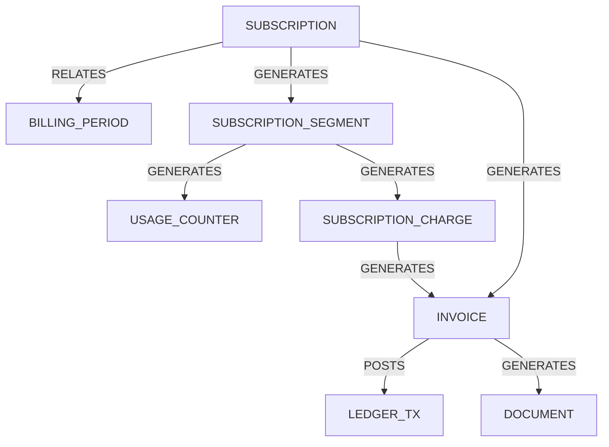

# CRM ↔ Money Flow integration

## Link graph (v3)

## ID mapping

| CRM object | Source table | Money Flow node type | Notes |
| --- | --- | --- | --- |
| Subscription | `crm_subscriptions` | `SUBSCRIPTION` | `subscription_id` |
| Segment | `crm_subscription_period_segments` | `SUBSCRIPTION_SEGMENT` | `segment_id` |
| Usage counter | `crm_usage_counters` | `USAGE_COUNTER` | `counter_id` |
| Charge | `crm_subscription_charges` | `SUBSCRIPTION_CHARGE` | `charge_id`, `charge_key` in meta |
| Invoice | `invoices` | `INVOICE` | `invoice_id` |
| Document | `documents` | `DOCUMENT` | `document_id` |
| Ledger tx | `internal_ledger_transactions` | `LEDGER_TX` | `ledger_transaction_id` |

## Replay instructions

1. Run the CRM subscription billing for the target billing period.
2. Use `/admin/money/replay` with `scope=SUBSCRIPTIONS` and `mode=COMPARE` to compare recomputed counters/charges with invoice totals.
3. Inspect `diff` and reconcile discrepancies before adjusting CRM pricing or invoice lines.

## Health checklist

- Subscription invoices have links to charges, documents, and ledger postings.
- `money_flow_events` for subscription invoices include snapshots BEFORE/AFTER.
- No duplicate `charge_key` values per subscription/period.
- Segments within a billing period do not have gaps or overlaps.
- `money_flow_links` cover every invoice and subscription charge.

## Definition of Done

- Billing runs write links for subscription → segment → usage/charge → invoice → document/ledger.
- Subscription CFO explain returns IDs for charges, counters, links, events, and snapshots.
- Replay scope `SUBSCRIPTIONS` can compare CRM recompute results with issued invoices.
- Health checks report missing links/snapshots and segment/charge_key anomalies.
