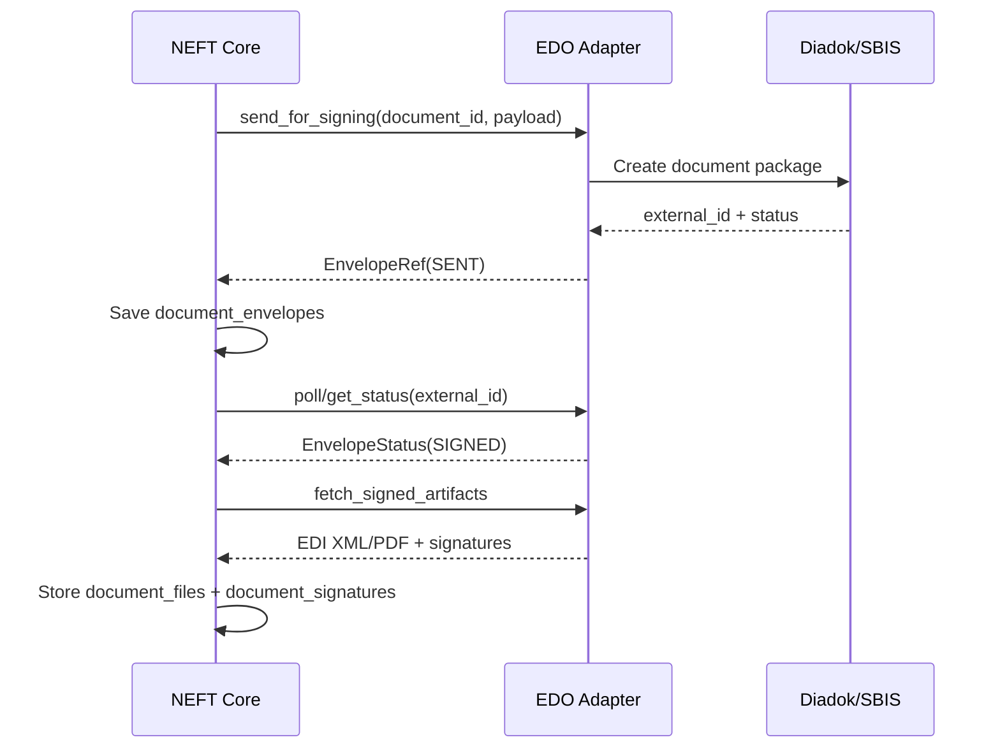

# ЭДО (Диадок/СБИС) overview

## Data model summary
- Same `document_envelopes`/`document_signatures` tables used for EDI.
- `document_files` supports `EDI_XML` file type.

## Security notes
- External IDs are unique per provider.
- Webhook signatures validated per provider (future).

## SLA for statuses
- Provider dependent; poll or webhook frequency defined in ops runbook.
