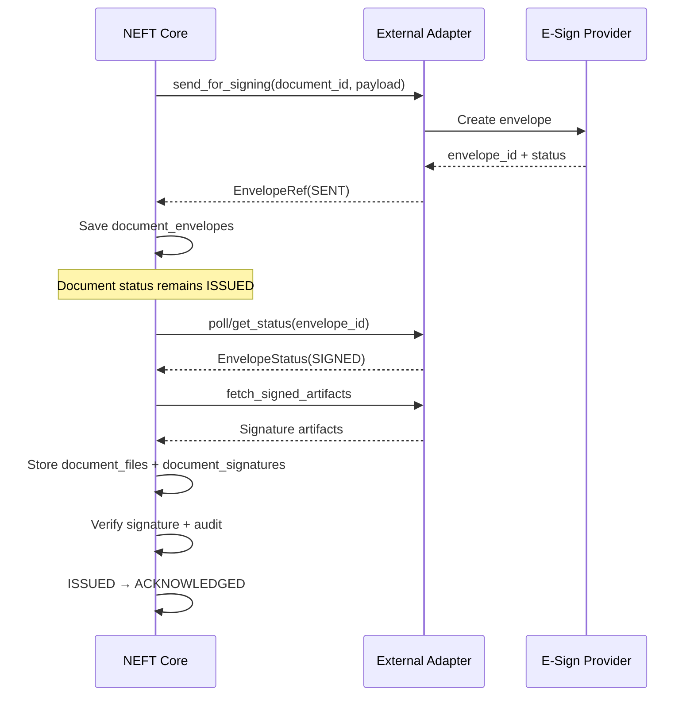

# E-sign Integrations Overview (v2)

## Data model summary
- `document_envelopes`: link document to external envelope (`provider`, `envelope_id`, `status`).
- `document_signatures`: signature artifacts, hash, verification, and certificate link.
- `certificates`: certificate registry for KЭП/ГОСТ verification.
- `legal_provider_configs`: per-tenant/client provider selection and signature requirement.

## Shared storage truth
- `document_signatures` is currently one shared storage table, not two separate persistence contours.
- `app.models.legal_integrations.DocumentSignature` owns provider-signing artifacts, version/status chain, verification details, and certificate linkage for e-sign/EDI flows.
- `app.domains.documents.models.DocumentSignature` owns the simple client document-sign/ack contour used by the general client docflow.
- Future consolidation should happen only after a caller inventory plus field-level parity audit; safe follow-up is a single explicit repository/owner layer, not a route flip or schema rewrite as a cleanup-only step.

## Security notes
- Webhook endpoints require admin auth and idempotency on `(provider, envelope_id, status_at)`.
- Signature verification defaults to structural checks, with optional cryptographic verification under feature flag.
- Audit events are emitted for all lifecycle transitions and verification results.

## SLA for statuses
- SENT → DELIVERED: provider dependent (minutes).
- DELIVERED → SIGNED: client signing SLA (hours/days).
- SIGNED → ACKNOWLEDGED: immediate after artifact fetch and verification.
