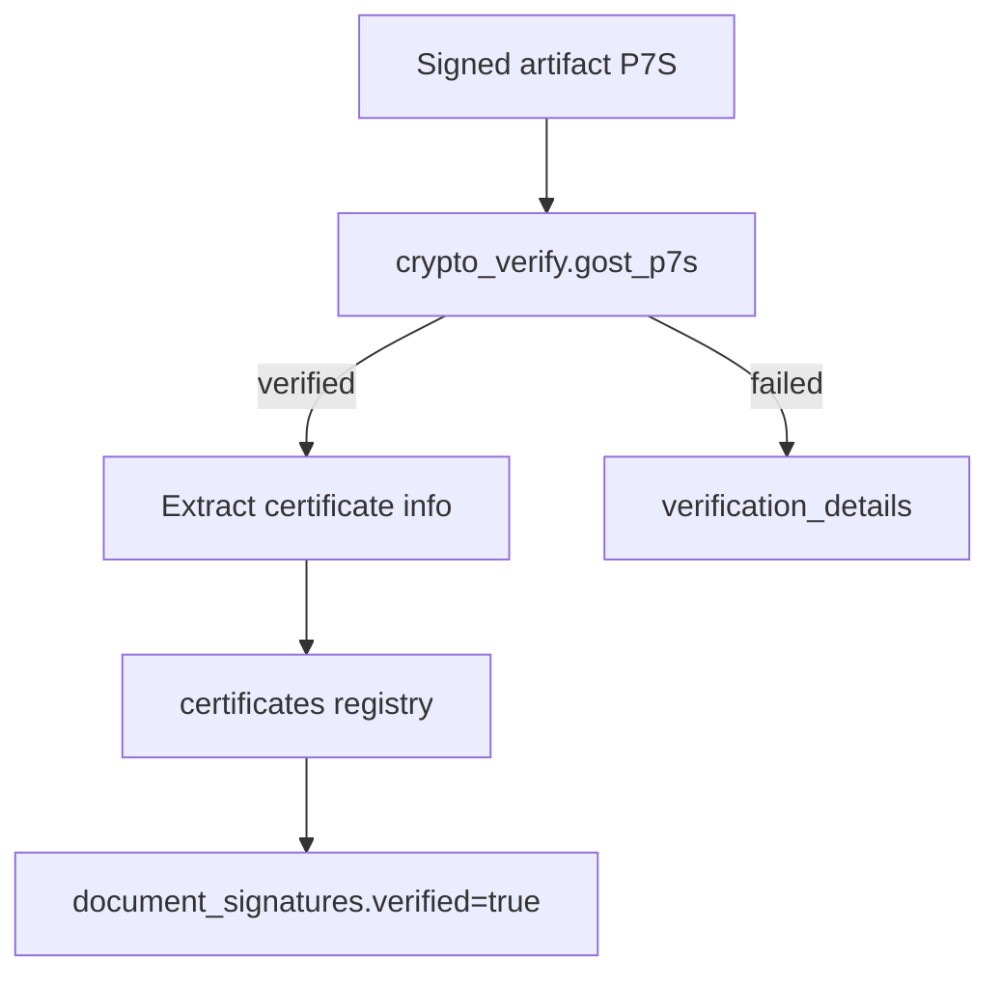

# КЭП / ГОСТ verification overview

## Data model summary
- `document_signatures.signature_type`: `KEP` / `GOST_P7S`.
- `certificates`: subject/issuer/serial/thumbprint, validity, revocation status.

## Security notes
- Cryptographic verification is gated by `LEGAL_GOST_VERIFY_ENABLED`.
- When disabled, verification result is recorded as `crypto_verification_disabled`.
- Store certificate metadata for audit and future chain validation.

## SLA for statuses
- Verification result stored immediately after artifact ingestion.
