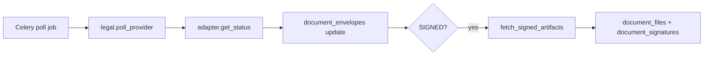

# Legal Integrations Runbook

## Operational flow
1. Enable provider via `legal_provider_configs` for tenant/client.
2. Send documents via `/v1/admin/documents/{id}/send-signing` or `/send-edo`.
3. Poll or accept webhook updates:
   - `/v1/admin/legal/poll/{provider}`
   - `/v1/admin/legal/webhook/{provider}`
4. Monitor audit events and signature verification results.

## Security notes
- Webhook endpoints require admin auth; validate provider signatures when available.
- Idempotency uses `(provider, envelope_id, status_at)` ordering.
- Audit records include provider metadata and verification outcome.

## SLA for statuses
- Polling interval: configure Celery schedule per provider (default every 5-10 min).
- Artifacts are persisted immediately upon `SIGNED`.
